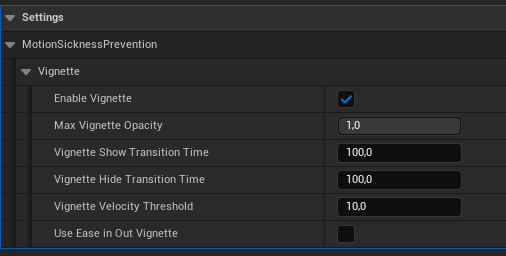

# Lumina Interaction Framework VR (LIFVR) Documentation

## 2. LIFVR Character

### 2.1 Character Hierarchy and Structure
The base class for the Hexa Character is the **<span style="color: #ADD8E6;">VRControllerCharacter</span>**. This class handles all inputs, including enhanced input actions and mapping contexts.

|   Hexa character classes/components:        | Description                                                                |
|--------------------------|----------------------------------------------------------------------------|
| 1. Hexa Character         | Main class of the physical VR character combining the other character classes and components, containing the VR camera and the motion controllers.     |
| 2. Hexa Physics Rig         | Manages physical collisions, bodies, and constraints of the character.     |
| 3. VR Physics Hands         | A VR hand class that enables physical grabbing and is physically connected to the Hexa Physics Rig. |
| 4.  LuminaVRMovement Component | Handles locomotion logic using Hexa Character and Hexa Physics Rig classes. |


The Hexa Character (BP_HexaCharacter) is fully physics-based, enabling interactive VR world experiences. It is heavily inspired by Boneworks/Bonelabs and the VRGK (Virtual Reality Game Kit) character. The character needs a Hexa Physics Rig (BP_HexaPhysRig) to work, which includes basic collision objects connected by physic constraints. This is assigned in the details panel of the character under `Settings/PhysicsRig` in the variable `Physics Rig Class`. There are no changes or customizations necessary to do in the Hexa Physics Rig. A collision solver component tracks collisions of different body parts within the Hexa Physics Rig, driving logic in the Hexa Character. You can find more information about the collision solver component here: [collision solver](#4.0-collision-solver-component) ([Interactions page](/interactions.md)) and about the character collision handling [here](#2.3-character-collisions).

Furthermore the Hexa Character needs right and left hand classes assigned of the type BP_VRPhysicsHand (class BP_VRPhysicsHand_Right and any children of it are compatible). These are defined under `Settings/Hands` in the variables `Hand Class R / L`. 


The Hexa Character class acts as the manager for all related classes, such as spawning and invoking the Hexa Physics Rig, LuminaVRMovementComponent, or the specified VR physics hands.


### 2.2 (Enhanced) Inputs and Mapping

The VR Controller Character handles the mapping from the enhanced input actions to the methods which should be called by them (eather in the VR Controller Character children classes or the LuminaVRMovementComponent).

**Mapping Context**:
    
- UInputMappingContext* **DefaultMappingContext**. This variable holds the default Mapping Context fthe Character. The mapping context maps enhanced inpactions like e.g. IA_GrabRight to the VR Controller Inputsg. OculusTouch (L) Grip Axis
The Default Value of this variable is set to **IM_VRCharacterDefault**. This mapping contecan be found in the content folder under Plugins/LIFContent/Input. You can see the default mappiIM_VRCharacterDefault in the image on the right side.

To change the default mapping create your own Input Mapping Context or change the bindings **IM_VRCharacterDefault**** as you'd like. Make sure to setup mappings for each Action (which can be found in the actions folder) and as as shown in **IM_VRCharacterDefault**. You can then easily assign your Mapping Context in the PB_HexaCharacter (or custom Child Character class) under the category Input to the DefaultMappingContext variable.

    


    

> [!NOTE]
> If you can't find the LIFVR Content in the content browser, you need to enable ```Show Plugin Content``` in the content browser settings (see [FAQ](/FAQ.md)) !

**Enhanced Input Actions**:

The Input actions of LIFVR can be found in the content browser under ```Plugins/LIVR Content/Input/Actions```.

The Input Actions contain the data for the input specifiying for example which input type (bool, axis 1D,...) the input for this action should be and which triggers should be used. For more information about enhanced input actions see https://dev.epicgames.com/documentation/en-us/unreal-engine/enhanced-input-in-unreal-engine.

The actions are the things the character can do, like Crouch, Move or Grab (as you can see in the image of the default mapping context). There are also more generic actions like APressLeft or IndexTouchRight. These are named more generic to fit for different use cases of mapping and function overrides. 

- The touch actions are only used for hand animations.
- IA_GrabRight, IA_GrabLeft as well as IA_IndexCurl_Right and IA_IndexCurl_Left call the grab methods in the character. In the default setup grabbing is possible with the grab button as well as with the grip button of the vr controller. This enables to have a distiction between loose grabbing (only grabbing with index finger (triggered by IA_IndexCurl_Right/Left)) and normal grabbing (triggered by IA_GrabRight/Left).
More information about grabbing: [VR Physics Hands](/hands.md).

The actions are bind in the VR Controller Character to the methods. The following shows a list of the actions their trigger types and the methods they are calling:

| Input Action              | Trigger Event  | Component/Character         | Method                               |
|---------------------------|----------------|-----------------------------|--------------------------------------|
| IA_Turn                   | Triggered      | LuminaVRMovementComponent   | Turn                                 |
| IA_Turn                   | Completed      | LuminaVRMovementComponent   | SetIsTurning                         |
| IA_Crouch                 | Triggered      | LuminaVRMovementComponent   | Crouching                            |
| IA_Crouch                 | Started        | LuminaVRMovementComponent   | CrouchingStart                       |
| IA_Crouch                 | Completed      | LuminaVRMovementComponent   | CrouchingReset                       |
| IA_Move                   | Started        | LuminaVRMovementComponent   | MovementStart                        |
| IA_Move                   | Triggered      | LuminaVRMovementComponent   | Move                                 |
| IA_Move                   | Completed      | LuminaVRMovementComponent   | MovementStop                         |
| IA_GrabRight              | Triggered      | AVRControllerCharacter      | Grab_R                               |
| IA_GrabLeft               | Triggered      | AVRControllerCharacter      | Grab_L                               |
| IA_GrabRight              | Completed      | AVRControllerCharacter      | Release_R                            |
| IA_GrabLeft               | Completed      | AVRControllerCharacter      | Release_L                            |
| IA_IndexCurl_Right        | Triggered      | AVRControllerCharacter      | TriggerPress_R                       |
| IA_IndexCurl_Left         | Triggered      | AVRControllerCharacter      | TriggerPress_L                       |
| IA_IndexCurl_Right        | Completed      | AVRControllerCharacter      | TriggerRelease_R                     |
| IA_IndexCurl_Left         | Completed      | AVRControllerCharacter      | TriggerRelease_L                     |
| IA_APressRight            | Triggered      | AVRControllerCharacter      | APress_R                             |
| IA_APressLeft             | Triggered      | AVRControllerCharacter      | APress_L                             |
| IA_APressRight            | Completed      | AVRControllerCharacter      | ARelease_R                           |
| IA_APressLeft             | Completed      | AVRControllerCharacter      | ARelease_L                           |
| IA_BPressRight            | Triggered      | AVRControllerCharacter      | BPress_R                             |
| IA_BPressLeft             | Triggered      | AVRControllerCharacter      | BPress_L                             |
| IA_Jump                   | Started        | AVRControllerCharacter      | JumpInput                            |
| IA_Jump                   | Completed      | AVRControllerCharacter      | JumpInputFinish                      |
| IA_CalibrateCharacter     | Triggered      | AVRControllerCharacter      | CalibrateCharacterInput              |
| IA_BPressRight            | Completed      | AVRControllerCharacter      | BRelease_R                           |
| IA_BPressLeft             | Completed      | AVRControllerCharacter      | BRelease_L                           |
| IA_Hand_ThumbStickPress_Right | Started    | AVRControllerCharacter      | Thumbstick_Press_R                   |
| IA_Hand_ThumbStickPress_Left | Started     | AVRControllerCharacter      | Thumbstick_Press_L                   |
| IA_Sprint                 | Started        | AVRControllerCharacter      | SprintInput                          |
| IA_IndexTouchRight        | Started        | AVRControllerCharacter      | IndexTouch_R                         |
| IA_IndexTouchLeft         | Started        | AVRControllerCharacter      | IndexTouch_L                         |
| IA_IndexTouchRight        | Completed      | AVRControllerCharacter      | IndexTouchRelease_R                  |
| IA_IndexTouchLeft         | Completed      | AVRControllerCharacter      | IndexTouchRelease_L                  |
| IA_ThumbTouchRight        | Started        | AVRControllerCharacter      | ThumbTouch_R                         |
| IA_ThumbTouchLeft         | Started        | AVRControllerCharacter      | ThumbTouch_L                         |
| IA_ThumbTouchRight        | Completed      | AVRControllerCharacter      | ThumbTouchRelease_R                  |
| IA_ThumbTouchLeft         | Completed      | AVRControllerCharacter      | ThumbTouchRelease_L                  |
| IA_ATouchRight            | Started        | AVRControllerCharacter      | AButtonTouch_R                       |
| IA_ATouchLeft             | Started        | AVRControllerCharacter      | AButtonTouch_L                       |
| IA_ATouchRight            | Completed      | AVRControllerCharacter      | AButtonTouchRelease_R                |
| IA_ATouchLeft             | Completed      | AVRControllerCharacter      | AButtonTouchRelease_L                |
| IA_BHoldRight             | Started        | AVRControllerCharacter      | BButtonRight_Start                   |
| IA_BHoldRight             | Completed      | AVRControllerCharacter      | BButtonRight_End                     |
| IA_ToggleMenu             | Triggered      | AVRControllerCharacter      | MenuToggle                           |


You have the oportunity to add logic to the methods by two ways:
1. Using the predefined events in the BP_HexaCharacter
2. Adding Input Listeners to the LIFVR Actions 

    This is useful if you want use other trigger types which are not already bound in the character, getting access to the raw input values or the predefined events in the character are not enough for you purpose. See for an example the crouch listeners binding in the BP_HexaCharacter. **Note: Adding logic there will not override the base logic/methods bound in C++**.

      
     

**Advanced Overrides**

    You can also override C++ methods to implement you're own logic and redesign the framework more in depth (this should do only really advanced users, because this will disable some features to work!).

    Most of the inputs trigger also the methods in the VR Hands which than do the finger animations and passing the input events through to the interaction solver to access them in the grabbed actor ((e.g. the trigger press as in the BP_SimpleGun).

    Hence it's not recommended to overwrite the logic completely, but if you want to change it you can disable the calling of the methods in the hands. You only need to set the specific bool in the details panel under Input/HandEventOverrides to true.

    e.g. OverrideBPress = True

> [!WARNING]
> This will also induce that in interaction points this specific event doesn't fire anymore.

    Further it's possible to disable Index Grab (grabbing with trigger button) completely by setting OverrideIndexGrabRight/Left = True. Note that if you disable this feature you can also not use the other features which depend on loose grabbing! (so this is not recommended).   

### 2.3 Character Data (Data Assets)

Key characteristics like the body proportions of the Hexa Physics Rig and the Hexa Character are defined by a **CharacterProportionsDA**. This data asset is assigned to the variable `BP_HexaCharacter -> CharacterProportions`. The **DefaultCharacterProportionsDA** is configured to match the proportions of the UE5 Mannequins. You can further customize the character by creating (duplicating the default data asset or creating a child data asset from the class CharacterProportionsDA) your own data asset and assigning it to the variable **CharacterProportions** in the BP_HexaCharacter. In this data asset, you can specify the exact local position of the pelvis or use the LegToBodyRatio. The **Default Character Height** represents the total height of the character in a standing position.

 

During calibration, the HMD automatically adjusts the height to match the virtual character height as defined in the data asset. This method is called once at the beginplay or after the player puts on the headset. Calibration can also be adjusted in the **MainMenu** under **Character** (to open the main menu press the menu button on the controller). The reference point for the HMD is floor level.

> [!TIP]
> If you encounter issues where the HexaPhysicsRig does not initialize correctly, check that your guardian is set up properly and the floor level is tracked accurately.

Currently, other character features like strength, jump strength, speed, etc., are not automatically adjusted by these proportions. In the future, there will be the possibility to enable automatic physics-based calculations for these features.

> [!WARNING]
> Be aware that changes made in the proportions may also change the behavior of the character because everything is physics based.

The second character data asset is the **CrouchConfigDA** in this data asset it's possible to control the positions (height and backward leaning) of the character for the different crouch levels. For each crouch level, you can define where the pelvis should be. Be aware that changes made here may also impact and change the behavior like the jump height, for example, if physical jumping is used. For a customized version, it's recommended to create a child or duplicate of the **DefaultCrouchConfigDA** so that you always have the default one as a backup.

### 2.4 Locomotion: LuminaVRMovementComponent

The locomotion of the character is managed by the **LuminaVRMovementComponent**. (This is a completely new component within LIFVR, not a child of Epic's movement component.

The Hexa Character has the following **movement states**:

```cpp
UENUM(BlueprintType)
enum class EVRMovementState : uint8
{
    Standing = 0,
    Walking,
    Sprinting,
    Jumping,
    Crouching,
    Climbing,
    Swimming,
    Tiptoeing
};
```

You can access them in the character by dragging in the LuminaVRMovementComponent reference and using the function `LuminaVRMovementComponent->GetCurrentMovementState()`.


In the details panel of the **LuminaVRMovementComponent** within the BP_HexaCharacter under the category **Settings**, you can configure essentially everything about the Hexa Physics Character, such as walking, sprinting, swimming speed, jump strength, crouch speed, and many more. 


In the sections below you can find a more detailed overview of the different variables in the settings of the LuminaVRMovementComponent.

Basicly each movement type like turning, jumping etc. has a variable called bAllow[MovementType] (e.g. bAllowSprinting, bAllowTurning,...). With these you can block or allow them dynamicly in you're gameplay. 


Furthermore each movement type has an boolean indicator bIs[MovementType] (e.g. bIsMoving, bIsJumping, etc.) which can be called to check if the movement is currently occuring. This is for gameplay logic useful besides the current movement state because movements can occur simultaneously, like walking and crouching.


There are two main locomotion modes:

    1.) Logical
    2.) Physical

The primary features are implemented for the **Physical locomotion mode**, which utilizes the HexaPhysicsRig for the HexaCharacter. Therefore, if you want a fully physics-based character and in any children of the HexaCharacter, you need to set the locomotion mode to `Physical`.

The Logical locomotion mode exists for those who prefer to use mainly the VRHands (NOT VRPhysicsHands) and a more logic-driven character. It is recommended to create a child of the ControllerCharacter and enhance or override functions in the LuminaVRMovementComponent to add logic-based locomotion. This mode has only implemented logical movement (see method `MoveLogical(FInputActionValue& Value)`) and turning.

For logical jumping, implement the event or override the method:
- in C++: `DoLogicalJumping()`
- in Blueprint: `LogicalJumping()`

#### Moving 
------------------------

The character is moving through a locomotion sphere in the Hexa Physics Rig. The input values of the thumbstick are transformed to a torque for the locomotion sphere. The magnitude for the torque is scaled by the speed values, which you can set in the settings of the LuminaVRMovementComponent -> Walking.

<p>


</p>

If the character crouches the movement speed is reduced automaticly. 

| Variable               | Description                                           |
|------------------------|-------------------------------------------------------|
| **Walking Speed**      | The speed at which the character walks if standing. |
| **Allow Sprinting**    | A boolean that enables or disables the ability to sprint. |
| **Sprinting Speed**    | The speed at which the character sprints. |
| **Crouching Speed Scale**    | A speed factor that is multiplied by the movement speed when auto speed adjustments are made based on the percentage of crouching. |

For logical locomotion mode with logical movement you can set directly the speed while crouching ```LogicalCrouchingSpeed (float)``` and enable automatic sprinting speed changes ```UseLogicalAutoSprintingSpeed (boolean)```. These settings can be found under LuminaVRMovementComponent -> Settings -> Locomotion -> Walking-> Logical.

You can access the current speed and velocity vector of the character with the following functions:


#### Turning 
------------------------

In LIFVR are two turn modes (EVRTurnMode (Enum)) implemented:

1. Smooth Turn
2. Snap Turn

You can set them in the variable ``` TurnMode ``` in the details panel of the LuminaVRMovementComponent: Settings->Locomotion->Turning.

Both turn modes work for the physical locomotion and the logical locomotion (LocomotionMode).

The TurnMode can also be changed in game in the main menu in the category **Controls**. There the buttons are bind to change the ``` TurnMode ``` variable in the HexaCharacter.

To rotate the character from logic you can use the `RotateRigSmooth(float angle)` method to rotate it smoothly with the specified angle. This is for example also used to rotate the character on rotating platforms.

#### Climbing
------------------------

Climbing works practically out of the box. Because the hands are physically connected to the character, to enable climbing it's only needed to give the climb able actor a grab tag (grabbing actor settings (see [VR Physics Hands](/hands.md))). Because the physics rig is quite heavy by default to be more stable for climbing it automaticly adjusts the weight to climb more easily. It also automaticly increases the AutoReleaseThreshold of the hands, so that the character does not auto release while climbing that easily. The character can automaticly climb crouch. This is triggered if the character tries to go over a ledge. It's possible to enable ```bAlwaysClimbCrouch``` (can also be set in the main menu: controls). Than it will always crouch when climbing.

> [!WARNING]
> Always climb crouch can be not completely stable, because it has to detect if it's climbing based on the hands state as well if the character touches the ground. So it can happen in a situation that it starts to climb crouch when it's not really desired for. A better way if one wants to use this is to use the optional ```climb tag```. In this way one has precise control in which situations it should automaticly crouch and when not.

**Settings**


| Variable                     | Description |
|------------------------------|-------------|
| **Use Climb Crouch**         | Enable or disable the automatic climb crouch feature. |
| **Only Two Handed Climb Crouch** | Define to only trigger climb crouch if currently climbing with both hands grabbing. This is mostly the case if one wants to go over a ledge (will be more reliable). |
| **ClimbCrouchHeadOffset**    | Defines the vertical offset the head has to be in front of the hands to trigger the climb crouch for going over ledges. -10.0 means the head has only to be slightly above the hands indicating a leaning forward. |
| **Always Climb Crouch**      | Enable to always crouch when climbing. See the note above for more information. |
| **Climb Strength**           | Define how easily the character can climb. 1 = most easy climb, 0 = heavy to climb. |


#### Crouching / TipToe
------------------------

The hexa character can crouch and tip toeing. In the default configuration crouching is triggered by pulling the right thumbstick down and tip toe by pulling it up. If the thumbstick is released while tip toe it automaticly goes back to standing height. The crouching is organized into crouch levels. If you release the thumbstick while crouching it will automaticly go to the nearest crouch level height. The following crouch levels exist.

**Crouch Levels**

- **TipToe**
- **Standing**
- **SlightCrouch**
- **MediumCrouch**
- **DeepCrouch**
- **MaxCrouch**: This crouch level is normally not allowed and only for jump crouch or climbing over a ledge enabled for better locomotion handling in these situations.

The height and pelvis position for the crouch levels is defined in the Crouch Config data asset: **CrouchConfigDA**. For customized crouch configs you can create a new data asset of this type or duplicate the default crouch config: **DA_DefaultCrouchConfig**. It can be found in the content browser under:


**DA_DefaultCrouchConfig**:


> [!WARNING]
> Changes in the crouch config will affect the physical behavior of the character, because everything is physics based. E.g. leaning more backwards with the pelvis position can lead the character to jump more in the forward direction. So you can try customizations, but it's recommendet to always have the original **DA_DefaultCrouchConfig** as backup.

**Settings**


| Variable                    | Description |
|-----------------------------|-------------|
| **AllowCrouching**          | Allow or block crouching with inputs (like thumbstick). Real player crouch will always lead to crouching of the character/HexaPhysicsRig. |
| **Crouching Speed**         | Defines the speed of the virtual crouching if thumbsticks are used. |
| **Crouch Config**           | This data asset holds information for the crouch levels, such as the target height of each crouch level and the pelvis position. Changes can affect physical behaviors like jumping. |
| **Crouch Curve**            | A float curve used for interpolated crouching; it defines the speed for this process. Interpolation crouch mode is used for actions like standing up fast to induce a physical jump. |
| **Crouch Interpolation Speed** | Defines the interpolation time for crouching via the interpolation mode. |
| **TipToeMaxOffsetHeight**   | Defines in cm the maximal offset height amount which is added to the standing height (default character height) for Tip Toe. |
| **Tip Toe Threshold**       | Height value offset which needs to be reached to tip toe if real player tip toes (not with thumbsticks). Useful for some neck freedom without directly starting to tip toe. |
| **TipToeInputThreshold**    | Deadzone for positive thumbstick axis which triggers tip toe. After 0.2 is reached through the thumbstick input, it will start with tip toe. |
| **Crouch Dead Zone**        | Deadzone for negative thumbstick axis which triggers crouching. After 0.15 is reached through the thumbstick input, it will start with crouching. |

The dead zones help to prevent to start crouching or tip toe (vertical thumbstick axis) when turning (vertical thumbstick axis), because of precision of the thumbsticks. You can increase the values if you want a higher distinction between these two inputs.

Crouch levels are automaticly adjusted if moving:

1. **Walking from Deeper Crouch Levels:**
   - If currently in a crouch level deeper than **Medium Crouch** and starting to walk, the crouch level automatically adjusts up to **Medium Crouch**.
   
2. **Sprinting from Crouching:**
   - If currently in a crouch level deeper than slight crouch and starting to sprint, the crouch level automatically adjusts up to **Slight Crouch**.

These auto adjustements can be overriden by the inputs, which is useful to walk under tight gaps for example.

To crouch driven from code logic there are two options:

1. **Interpolation mode**: Use the interpolation mode in the LuminaVRMovementComponent. For this you first need to set ```bUseInterpolationCrouchMode = true```. Afterwards you can call the function ``` SetCrouchLevel(ECrouchLevel NewCrouchLevel)```. This sets a target height for the character based on the crouch level. It's important to implement logic to reset the interpolation mode by ```bUseInterpolationCrouchMode = false``` and calling afterwards ```ResetCrouchLevelOverride()```, because the interpolation mode overrides the target height for the character and the default crouch calculations.

2. **Simulate thumbstick input**: You can call continously (e.g. in a custom timer) the method ```UpdateVirtualCrouchOffsetAdd(Offset)```. This will let the character crouch downwards for offsets > 0.0 and upwards for offsets < 0.0. The speed scales by |offset|. Important it'S important to have a checking condition when the desired height is reached and to stop the loop than. Useful is here e.g. the function ```GetCurrentCrouchPercentage()```. If finished set ```VirtualCrouchOffset = 0.0f``` to immediately stop there. 

**Auto Crouch**

The character crouches automaticly if it's head is blocked above for all objects with the colliding component beeing not a physisc body. This system uses the HeadOverlap component in the HexaCharacter. If an object overlaps with the HeadOverlap component and is not from object type physics body, the character automaticly crouches. Moreover it's not possible to stand up with inputs if the head is blocked or to jump. If jumping and getting blocked the jumping is immediatly finished. 

> [!IMPORTANT]
> For the system to work it's important that the object blocks the VRPhysicsPawn collision channel. By default everything is set to block the character.

> [!NOTE]
> To enable automatic crouching and adjustments for a physics body component you need to add the AutoCrouchTag (Default value = "autocrouch") eather as component tag or as actor tag. You can change the tag names in the DA_TagConfig. In this way it's ensured the automatic crouching is really only triggered if wanted and not for example while hiding in a locker or from grabbed physics actors.
 
#### Jumping
------------------------

In LIFVR are currently two jump types implemented: 

    1.) Impulse Jumping
    2.) Physical Jumping

You can define them in the LuminaVRMovement component in the ```EVRJumpingTypes JumpingType``` variable (Settings->Jumping).

> [!IMPORTANT]
> Both of them need the physical locomotion mode enabled, because they rely on the HexaPhysicsRig.

The jump type Logical Jumping is called if the Logical Locomotion mode is used. This is only thought for users who don'T want to use the HexaPhysicsCharacter, but create their character based on the Controller Character with more logic driven locomotion. For this you need to implement a lot of logic by yourself, like the logical jumping. For this mode only turning and logical moving is currently implemented.

For logical jumping, implement the event or override the method:
- in C++: `DoLogicalJumping()`
- in Blueprint: `LogicalJumping()`

**Impulse Jumping**

This jumping type works through adding an upward impulse to the HexaCharacter. It is directly triggered if the IA_Jump action is started. This input action calls the `JumpingStart()` method which then calls for Impulse Jumping the `DoImpulseJumping()` method. In there the **`OnJump`** event is triggered, which you can find in the HexaCharacter event graph.

**Physical Jumping**

In this jumping type the character jumps, because of it's physical properties. The character crouches and stands up rapidly to jump. The physical jumping is ordered into Jumping Stages (`EPhysJumpingStage JumpingStage`).

Jumping stages:

1. **JumpCrouch**
2. **Jumping**
3. **InAir**
4. **Landing**

You can access the current jumping stage by the event `OnPhysicalJumpingStageChanged` in the HexaCharacter or with the getter `GetJumpingStage()` in the LuminaVRMovementComponent.


When the IA_Jump action is started it calls the `JumpingStart()` method, which then calls `StartPhysicalJumping()` if not currently already jumping (`bIsJumping`) and jumping is allowed (`bAllowJumping`). Here the **OnJumpingStarted** event fires.

1. **JumpCrouch**: If started the character crouches until it reaches the crouch percentage defined in `JumpCrouchAmount`. It holds this position until the comleted event of the IA_Jump action is triggered. 

2. **Jumping**: Then the method `JumpingStop()` and in there the method `DoPhysicalJumping()` is called. Here the **OnJump** event fires. If the completed event was less than 0.25 seconds of the started event ago then the jump is called with a small delay so that the character has enough time (to the 0.25 seconds) to crouch enough so that lift up is possible for the jump.

3. **InAir**: As soon as the character is lift up of the ground it is in the InAir jumping stage. It's possible to enable `bUseCrouchInAir`, so that the HexaCharacter automaticly tries to crouch while jumping to the target crouch level as specified in `JumpInAirCrouchLevel`. This is useful so that the character can more easily jump on objects with a lower total jump height needed. The `CrouchInAirCirCurve` defines the interpolation to the crouch level. This feature is currently experimental and still work in progress. So it can feel a bit unnatural currently, but will be optimized in the future. Furthermore one can crouch manually with the thumbsticks to crouch.

4. **Landing**: When the HexaCharacter touches the ground again it is in the landing stage. Here it automaticly tries to stand up again, if crouching was used before. A further currently experimental feature is crouch landing (`bUseCrouchLanding`), so the character crouches deeper again when touching the ground. The height for this crouching depends on the force it has to the ground and only is performed if this force is higher than the specified `LandingForceThreshold`. 

After the landing when the interpolation is also done for standinf up the **OnJumpingFinished** Event fires.

> [!NOTE]
> The Crouch landing also works without jumping before, so for example if falling down.

The landing hit fires the OnLanding event (see BP_HexaCharacter event graph). This does also fire if `bUseCrouchLanding = False`. You can access the entire Hit result, as well as the adjusted impact force and if the landing occured after a jump or not. This is for example useful in gameplay to check if the impact force was to high to kill the character or breaking bones.


> [!WARNING]
> Because this jumping is completely based on physics the character proportions, the crouch configuration and the crouch speed have an impact on the jumping.

**Overview of all setting variables for jumping**

All settings for jumping can be found in the HexaCharacter in the LuminaVRMovement component under Settings -> Jumping.


| Variable                    | Subcategory      | Description |
|-----------------------------|------------------|-------------|
| **Allow Jumping**           | General          | Enables or disables the ability to jump. |
| **Jump Strength Scaler**    | General          | Scales the overall strength (height) of the jump for all jumping types. |
| **Jumping Type**            | General          | Specifies the type of jumping mechanic, e.g., Physical Jumping. |
| **Jump Crouch Amount**      | Physical Jumping | Defines how much the character crouches before jumping (0 = standing, 1 = full crouch) |
| **Jump Strength Multiplier**| Physical Jumping | Multiplier for the stand up speed interpolation. |
| **Jump in Air Crouch Level**| CrouchInAir      | Defines the crouch level when jumping in the air, e.g., Max Crouch. |
| **Crouch in Air Curve**     | CrouchInAir      | A curve representing how crouching behavior (interpolation to JumpInAirCrouchLevel) is handled while in the air. |
| **Use Crouch in Air**       | CrouchInAir      | Toggles to automaticly crouch while in the air. |
| **Jump Strength**           | Impulse Jumping  | Absolute strength of the jump when using impulse jumping. |
| **Jump Reset Delay**        | Impulse Jumping  | The cooldown time in seconds before another jump can be initiated. |
| **Use Crouch Before Jump**  | Impulse Jumping  | Enables the character to crouch before making a jump also in impulse jumping. |
| **Crouch Before Jump Amount** | Impulse Jumping | The degree to which the character crouches before jumping, expressed as a fraction of full crouch. |
| **Landing Force Threshold** | CrouchLanding    | The force threshold for landing, which defines if the landing event is fired through the hit. |


#### Swimming
------------------------

To create a zone in which the Hexa Character should swim you only need to drag the BP_SwimZone blueprint into you're level. You can find it in the content browser under `Plugins/LIFVR Content/Blueprints/INteractions/Fields`. It is a child of the BP_ZeroGravityZone. The zone simply detects the character and triggeres the swimming logic in the LuminaVRMovement component of the character.

- ```StartSwimming()```: Sets the movement state and increases the linear damping of the character. Furthermore it adds the simple color overlay if this one is used.
- ```SwimmingTick()```: Tracks the hand motion, velocity and calcualtes the force for the character. 
- ```StopSwimming()```: Stops the swimming tick and resets all swimming variables.

You can swim by making a swimming gesture. The movement component tracks the celocity of you're hands and calculates the force in which the character should move/swim. You can enable or disable swimming with the variable `bAllow Swimming` and scale the speed of the swimming with `Swimming Speed` float (higher means faster) in the settings of the LuminaVRMovementComponent under `Settings -> Locomotion -> Swimming`


It also detects if the head is under water and uses a post process effect for under water. Therefore the zone has a post process component. This component is added in BP, so if you don't want to use the post process effect and create a cheaper material for this (e.g. for mobile platform) you can just delete the component in the swimming area or set `bUsePostProcessEffect = False` in the swimming area.

For the post process effect you can use eather a simple color overlay which you can enable through `bUseSimpleColorSwimOverlay = True` and adjust via the variable `Simple Color Overlay` in the settings of the LuminaVRMovementComponent or the **M_UnderwaterEffect** material for a more advanced effect (See: PLugins/LIFVR Content/Materials/Base).

The zone has also a visualizing static mesh component with a default water material of the starter content of epic. You can change this material to the water material of you're liking in the **AreaVisual** component. Because this is a static mesh component attached to the trigger box **Area** scale the **Area** component to adjust the zone in the level (not the box extent). In this way the visualizer scales automaticly correct.

You can add logic after the swim events (see image below). To check if currently swimming you can use the movement state or with the function `IsSwimming()` in the LuminaVRMovement component in the character. Further it's possible to access the swim direction (return: FVector) or the swim speed (return: float) with the functions `GetCurrentSwimDirection(bool bNormalize)` and `GetCurrentSwimSpeed()`. 


#### Slopes, Slides and Rotating Ground
------------------------

**Slopes**

The HexaCharacter detects slopes and acts as specified on them. In general it's heavier for the character to move upwards than downwards on slopes (speed scales with slope angle).
In the LuminaVRMovement (or HexaCharacter) details panel under Settings -> Locomotion -> Slopes you can define the 

* **Max Walkable Slope Angle**: On slopes steeper than this angle the HexaCharacter can not move/walk upwards. 
* **Max Standable Slope Angle**: On slopes steeper than this angle the HexaCharacter is sliding down with acceleration. 


You can get the current slope angle of the ground the character stands on with the **OnSlopeUpdate** event dispatcher or the method `GetCurrentSlopeAngle()` in the LuminaVRMovementComponent. Additionally you can check if the character is currently moving upwards or downwards on the slope with the `IsMovingUphillMethod()` and the `GetMovementDirection()` functions.

<p>


<p>

IF you need even more information of the ground, like the physical material or the friction value you can access the last ground Hit result of the HexaPhysicsRig with the function `GetRecentFloorHit()` in there.


**Slides**

If the ground has a physical material with low or no friction the HexaPhysicsRig will automaticly slide down. See the slide example in The Lumina Museum Map.


**Rotating Floor**

To enable that the HexaCharacter rotates automaticly with a rotating floor you only need to set the rotating floor tag `rotate` (default FName) in the actor or rotating components. If everything in the actor rotates use the actor tag, otherwise set the component tag of the specific component which rotates. See examples: `BP_Rotating_Platforms` in the content browser under Plugin/LIFVR Content/Blueprints/LevelArchitecturePhysics. 

> [!NOTE]
> You can change this tag value in the **DA_TagConfig** in the content folder: Plugins/LIFVR/LIFVR Content/Blueprints/Core.


The character is rotated by smoothly updating it's rotation via the `RotateRigSmoothly(float angle)` function in the LuminaVRMovementComponent. Input for turning are not overriden by this rotation, so the character can still turn manually.

### 2.3 Character collisions

### 2.4 Motion Sickness Prevention

The Hexa Character includes a Vignette child actor component (BP_ViewVignette / AViewVignette (C++)) which can be used to prevent motion sickness. It can be enabled or disabled in the main menu or in the BP_HexaCharacter Settings -> Motion Sickness Prevention -> Vignette.  



**Settings:**

| Variable                          | Description |
|----------------------------------|-------------|
| **Enable Vignette**              | Enables or disables the vignette effect for motion sickness prevention. |
| **Max Vignette Opacity**         | Sets the maximum opacity of the vignette. A higher value makes the vignette more pronounced. |
| **Vignette Show Transition Time**| Time it takes for the vignette to fully appear once triggered. |
| **Vignette Hide Transition Time**| Time it takes for the vignette to fully disappear once deactivated. |
| **Vignette Velocity Threshold**  | Velocity threshold the character needs to move for the vignette to appear. |
| **Use Ease in Out Vignette**     | Determines whether the vignette transition uses an easing function to appear and disappear (default: linear). |


> [!NOTE]
> Teleportation will be added in the next update.

### 2.5 Slow Motion Mode
The character features an integrated slow motion mode, similar to what is seen in Bonelabs/Boneworks. By pressing the right thumbstick, this mode can be activated. Quick successive presses can further slow down the time. After a threshold time (variable: `SlowMotionPressThreshold`), which needs to be maintained between the thumbstick presses, another press will deactivate the slow motion.

- Time Dilation > 1.0 : speed up
- Time Dilation = 1.0 : normal
- Time Dilation < 1.0 : slow motion


**Settings:**

In the details panel of the Hexa Character under Settings -> Slow  Motion, you can find the variables to setup or customize slow motion.

|       Variable                 | Description |
|--------------------------------|-------------|
| **bEnableSlowMotion**        | Enable or disable slow motion |
| **SlowMotionTimeDilation**| Value to multiply the current time dilation with each step the time dilation is increased (e.g. 0.5 means the time dilation is halved with each press). |
| **Maximaltimedilation**    | Lower bound for the time dilation value. |


> [!WARNING]
> Be aware that the slow motion mode can also affect physical calculations.

You can retrieve the current slow motion time dilation for any actor placed in the world by using the node `GetActorTimeDilation`. For example, see how this is implemented for the shooting sound in **BP_SimpleGun**.

In the BP_HexaCharacter or you're custom child character class you can add logic which should happen on slow motion changes by using the event `OnSlowMotionChanged`.


