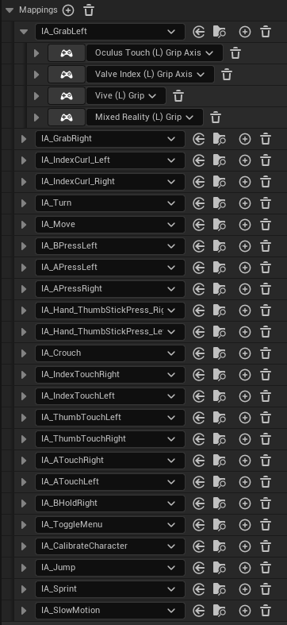
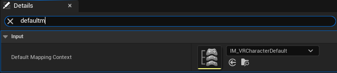
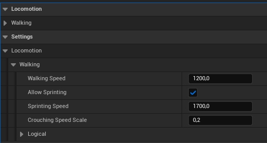

# Lumina Interaction Framework VR (LIFVR) Documentation

## 2. LIFVR Character

### 2.1 Character Hierarchy and Structure
The base class for the Hexa Character is the **<span style="color: #ADD8E6;">VRControllerCharacter</span>**. This class handles all inputs, including enhanced input actions and mapping contexts.

The Hexa Character (BP_HexaCharacter) is fully physics-based, enabling interactive VR world experiences. It is heavily inspired by Boneworks/Bonelabs and the VRGK (Virtual Reality Game Kit) character. The character is powered by a Hexa Physics Rig (BP_HexaPhysRig), which includes basic collision objects connected by physic constraints. A collision solver component tracks collisions of different body parts within the Hexa Physics Rig, driving logic in the Hexa Character.

The character class acts as the manager for all related classes, such as spawning and invoking the Hexa Physics Rig, LuminaVRMovementComponent, or the specified VR physics hands.

### 2.2 (Enhanced) Inputs and Mapping

The VR Controller Character handles the mapping from the enhanced input actions to the methods which should be called by them (eather in the VR Controller Character children classes or the LuminaVRMovementComponent).

**Mapping Context**:
    

- UInputMappingContext* **DefaultMappingContext**. This variable holds the default Mapping Context fthe Character. The mapping context maps enhanced inpactions like e.g. IA_GrabRight to the VR Controller Inputsg. OculusTouch (L) Grip Axis
The Default Value of this variable is set to **IM_VRCharacterDefault**. This mapping contecan be found in the content folder under Plugins/LIFContent/Input. You can see the default mappiIM_VRCharacterDefault in the image on the right side.

To change the default mapping create your own Input MappContext or change the bindings **IM_VRCharacterDefault**** as you'd like. Msure to setup mappings for each Action (which can be foin the actions folder) as shown**IM_VRCharacterDefault**. You can then easassign your Mapping Context in the Character BP under category Input to the DefaultMappingContext variable.

    


    

> **_NOTE:_** If you can't find the LIFVR Content in the content browser, you need to enable ```Show Plugin Content``` in the content browser settings (see [FAQ](/FAQ.md)) !

**Enhanced Input Actions**:

The Input actions of LIFVR can be found in the content browser under ```Plugins/LIVR Content/Input/Actions```.

The Input Actions contain the data for the input specifiying for example which input type (bool, axis 1D,...) the input for this action should be and which triggers should be used. For more information about enhanced input actions see https://dev.epicgames.com/documentation/en-us/unreal-engine/enhanced-input-in-unreal-engine.

The actions are the things the character can do, like Crouch, Move or Grab (as you can see in the image of the default mapping context). There are also more generic actions like APressLeft or IndexTouchRight. These are named more generic to fit for different use cases of mapping and function overrides. 

- The touch actions are only used for hand animations.
- IA_GrabRight, IA_GrabLeft as well as IA_IndexCurl_Right and IA_IndexCurl_Left call the grab methods in the character. In the default setup grabbing is possible with the grab button as well as with the grip button of the vr controller. This enables to have a distiction between loose grabbing (only grabbing with index finger (triggered by IA_IndexCurl_Right/Left)) and normal grabbing (triggered by IA_GrabRight/Left).
More information about grabbing: [VR Physics Hands](/hands.md).

The actions are bind in the VR Controller Character to the methods:

| Input Action              | Trigger Event  | Component/Character         | Method                               |
|---------------------------|----------------|-----------------------------|--------------------------------------|
| IA_Turn                   | Triggered      | LuminaVRMovementComponent   | Turn                                 |
| IA_Turn                   | Completed      | LuminaVRMovementComponent   | SetIsTurning                         |
| IA_Crouch                 | Triggered      | LuminaVRMovementComponent   | Crouching                            |
| IA_Crouch                 | Started        | LuminaVRMovementComponent   | CrouchingStart                       |
| IA_Crouch                 | Completed      | LuminaVRMovementComponent   | CrouchingReset                       |
| IA_Move                   | Started        | LuminaVRMovementComponent   | MovementStart                        |
| IA_Move                   | Triggered      | LuminaVRMovementComponent   | Move                                 |
| IA_Move                   | Completed      | LuminaVRMovementComponent   | MovementStop                         |
| IA_GrabRight              | Triggered      | AVRControllerCharacter      | Grab_R                               |
| IA_GrabLeft               | Triggered      | AVRControllerCharacter      | Grab_L                               |
| IA_GrabRight              | Completed      | AVRControllerCharacter      | Release_R                            |
| IA_GrabLeft               | Completed      | AVRControllerCharacter      | Release_L                            |
| IA_IndexCurl_Right        | Triggered      | AVRControllerCharacter      | TriggerPress_R                       |
| IA_IndexCurl_Left         | Triggered      | AVRControllerCharacter      | TriggerPress_L                       |
| IA_IndexCurl_Right        | Completed      | AVRControllerCharacter      | TriggerRelease_R                     |
| IA_IndexCurl_Left         | Completed      | AVRControllerCharacter      | TriggerRelease_L                     |
| IA_APressRight            | Triggered      | AVRControllerCharacter      | APress_R                             |
| IA_APressLeft             | Triggered      | AVRControllerCharacter      | APress_L                             |
| IA_APressRight            | Completed      | AVRControllerCharacter      | ARelease_R                           |
| IA_APressLeft             | Completed      | AVRControllerCharacter      | ARelease_L                           |
| IA_BPressRight            | Triggered      | AVRControllerCharacter      | BPress_R                             |
| IA_BPressLeft             | Triggered      | AVRControllerCharacter      | BPress_L                             |
| IA_Jump                   | Started        | AVRControllerCharacter      | JumpInput                            |
| IA_Jump                   | Completed      | AVRControllerCharacter      | JumpInputFinish                      |
| IA_CalibrateCharacter     | Triggered      | AVRControllerCharacter      | CalibrateCharacterInput              |
| IA_BPressRight            | Completed      | AVRControllerCharacter      | BRelease_R                           |
| IA_BPressLeft             | Completed      | AVRControllerCharacter      | BRelease_L                           |
| IA_Hand_ThumbStickPress_Right | Started    | AVRControllerCharacter      | Thumbstick_Press_R                   |
| IA_Hand_ThumbStickPress_Left | Started     | AVRControllerCharacter      | Thumbstick_Press_L                   |
| IA_Sprint                 | Started        | AVRControllerCharacter      | SprintInput                          |
| IA_IndexTouchRight        | Started        | AVRControllerCharacter      | IndexTouch_R                         |
| IA_IndexTouchLeft         | Started        | AVRControllerCharacter      | IndexTouch_L                         |
| IA_IndexTouchRight        | Completed      | AVRControllerCharacter      | IndexTouchRelease_R                  |
| IA_IndexTouchLeft         | Completed      | AVRControllerCharacter      | IndexTouchRelease_L                  |
| IA_ThumbTouchRight        | Started        | AVRControllerCharacter      | ThumbTouch_R                         |
| IA_ThumbTouchLeft         | Started        | AVRControllerCharacter      | ThumbTouch_L                         |
| IA_ThumbTouchRight        | Completed      | AVRControllerCharacter      | ThumbTouchRelease_R                  |
| IA_ThumbTouchLeft         | Completed      | AVRControllerCharacter      | ThumbTouchRelease_L                  |
| IA_ATouchRight            | Started        | AVRControllerCharacter      | AButtonTouch_R                       |
| IA_ATouchLeft             | Started        | AVRControllerCharacter      | AButtonTouch_L                       |
| IA_ATouchRight            | Completed      | AVRControllerCharacter      | AButtonTouchRelease_R                |
| IA_ATouchLeft             | Completed      | AVRControllerCharacter      | AButtonTouchRelease_L                |
| IA_BHoldRight             | Started        | AVRControllerCharacter      | BButtonRight_Start                   |
| IA_BHoldRight             | Completed      | AVRControllerCharacter      | BButtonRight_End                     |
| IA_ToggleMenu             | Triggered      | AVRControllerCharacter      | MenuToggle                           |


You have the oportunity to add logic to the methods by two ways:
1. Using the predefined events in the BP_HexaCharacter
2. Adding Input Listeners to the LIFVR Actions 

    This is useful if you want use another trigger which is not already bound in the character, getting access to the raw input values or the predefined events in the character are not enough for you purpose. See for an example the crouch listeners binding in the BP_HexaCharacter. **Note: Adding logic there will not override the base logic/methods bound in C++**.

      
     

**Advanced Overrides**

    You can also override C++ methods to implement you're own logic and redesign the framework more in depth (this should do only really advanced users, because this will disable some features to work!).

    Most of the inputs trigger also the methods in the VR Hands which than do the finger animations and passing the input events through to the interaction solver to access them in the grabbed actor ((e.g. the trigger press as in the BP_SimpleGun).

    Hence it's not recommended to overwrite the logic completely, but if you want to change it you can disable the calling of the methods in the hands. You only need to set the specific bool in the details panel under Input/HandEventOverrides to true.

    e.g. OverrideBPress = True

> **_NOTE:_** This will also induce that in interaction points events do't fire anymore.

    Further it's possible to disable Index Grab (grabbing with trigger button) completely. Note that if you disable this feature you can also not use the other features which depend on loose grabbing! (so this is not recommended)   

### 2.3 Character Data (Data Assets)
Key characteristics like the body proportions of the Hexa Physics Rig and the Hexa Character are defined by a **CharacterProportionsDA**. This data asset is assigned to the variable `BP_HexaCharacter -> CharacterProportions`. The **DefaultCharacterProportionsDA** is configured to match the proportions of the UE5 Mannequins. You can further customize the character by creating (duplicating the default data asset or creating a child data asset from the class CharacterProportionsDA) your own data asset and assigning it to the variable **CharacterProportions** in the BP_HexaCharacter. In this data asset, you can specify the exact local position of the pelvis or use the LegToBodyRatio. The **Default Character Height** represents the total height of the character in a standing position.

During calibration, the HMD automatically adjusts the height to match the virtual character height as defined in the data asset. This method is called once at the beginplay or after the player puts on the headset. Calibration can also be adjusted in the **MainMenu** under **Character** (hold the B button for a few seconds to open the menu). The reference point for the HMD is floor level.

> **_NOTE:_** If you encounter issues where the HexaPhysicsRig does not initialize correctly, check that your guardian is set up properly and the floor level is tracked accurately.

Currently, other character features like strength, jump strength, speed, etc., are not automatically adjusted by these proportions. In the future, there will be the possibility to enable automatic physics-based calculations for these features.

> **_NOTE:_** Be aware that changes made in the proportions may also change the behavior of the character because everything is physics based.

The second character data asset is the **CrouchConfigDA** in this data asset it's possible to control the positions (height and backward leaning) of the character for the different crouch levels. For each crouch level, you can define where the pelvis should be. Be aware that changes made here may also impact and change the behavior like the jump height, for example, if physical jumping is used. For a customized version, it's recommended to create a child or duplicate of the **DefaultCrouchConfigDA** so that you always have the default one as a backup.

### 2.4 Locomotion: LuminaVRMovementComponent
The locomotion of the character is managed by the **LuminaVRMovementComponent**. This is a completely new component within LIFVR, not a derivative of Epic's movement component.

The Hexa Character has the following **movement states**:

```cpp
UENUM(BlueprintType)
enum class EVRMovementState : uint8
{
    Standing = 0,
    Walking,
    Sprinting,
    Jumping,
    Crouching,
    Climbing,
    Swimming,
    Tiptoeing
};
```

You can access them in the character by dragging in the LuminaVRMovementComponent reference and using the function `LuminaVRMovementComponent->GetCurrentMovementState()`.


In the details panel of the **LuminaVRMovementComponent** within the BP_HexaCharacter under the category **Settings**, you can configure essentially everything about the Hexa Physics Character, such as walking, sprinting, swimming speed, jump strength, crouch speed, and many more. 


Below is a table providing an overview of some of the variables in the settings of the LuminaVRMovementComponent:

There are two main locomotion modes:

    1.) Logical
    2.) Physical

The primary features are implemented for the **Physical locomotion mode**, which utilizes the HexaPhysicsRig for the HexaCharacter. Therefore, if you want a fully physics-based character and in any children of the HexaCharacter, you need to set the locomotion mode to `Physical`.

The Logical locomotion mode exists for those who prefer to use mainly the VRHands (NOT VRPhysicsHands) and a more logic-driven character. It is recommended to create a child of the ControllerCharacter and enhance or override functions in the LuminaVRMovementComponent to add logic-based locomotion. This mode has only implemented logical movement (see method `MoveLogical(FInputActionValue& Value)`) and turning.

For logical jumping, implement an event or override the method:
- in C++: `DoLogicalJumping()`
- in Blueprint: `LogicalJumping()`

#### Moving 

The character is moving through a locomotion sphere in the Hexa Physics Rig. The input values of the thumbstick are transformed to a torque for the locomotion sphere. The magnitude for the torque is scaled by the speed values, which you can set in the settings of the LuminaVRMovementComponent -> Walking.

<p>


</p>

If the character crouches the movement speed is reduced automaticly. 

| Variable               | Description                                           |
|------------------------|-------------------------------------------------------|
| **Walking Speed**      | The speed at which the character walks if standing. |
| **Allow Sprinting**    | A boolean that enables or disables the ability to sprint. |
| **Sprinting Speed**    | The speed at which the character sprints. |
| **Use Auto Sprinting Speed** | A boolean setting that, when enabled, allows the system to automatically adjust sprinting speed based on other factors or conditions. |
| **Crouching Speed Scale**    | A speed factor that is multiplied by the movement speed when auto speed adjustments are made based on the percentage of crouching. |

For logical locomotion mode with logical movement you can set directly the speed while crouching ```LogicalCrouchingSpeed (float)``` and enable automatic sprinting speed changes ```UseLogicalAutoSprintingSpeed (boolean)```. These settings can be found under LuminaVRMovementComponent -> Settings -> Locomotion -> Walking-> Logical.


#### Turning 

In LIFVR are two turn modes (EVRTurnMode (Enum)) implemented:

1. Smooth Turn
2. Snap Turn

You can set them in the variable ``` TurnMode ``` in the details panel of the LuminaVRMovementComponent: Settings->Locomotion->Turning.

Both turn modes work for the physical locomotion and the logical locomotion (LocomotionMode).

The TurnMode can also be changed in game in the main menu in the category **Controls**. There the buttons are bind to change the ``` TurnMode ``` variable in the HexaCharacter.

#### Climbing
#### Crouching / TipToe
#### Swimming
#### Jumping
#### Slopes

### 2.3 Default Controls and How to Change Input Mapping (Enhanced Inputs)
In the picture below, you can see the default input mapping of the Hexa character. [Insert Picture or Provide Link]

### 2.4 Motion Sickness Prevention
The Hexa Character includes a Vignette actor component which can be used to prevent motion sickness. It can be enabled or disabled in the main menu or within the **LuminaVRMovementComponent** (Settings).

Teleportation will be added in the next update.

### 2.5 Slow Motion Mode
The character features an integrated slow motion mode, similar to what is seen in Bonelabs/Boneworks. By pressing the right thumbstick, this mode can be activated. Quick successive presses can further slow down the time. After a threshold time (variable: `[specify variable]`), which needs to be maintained between the thumbstick presses, another press will deactivate the slow motion. 

> **_NOTE:_** Be aware that the slow motion mode can also affect physical calculations.

You can retrieve the current slow motion time dilation for any actor placed in the world by using the node `GetActorTimeDilation`. For example, see how this is implemented for the shooting sound in **BP_SimpleGun**.


