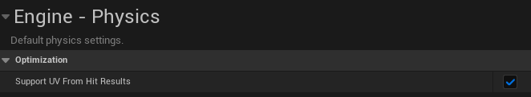

# Lumina Interaction Framework VR (LIFVR) Documentation

## 9. Drawing

> [!IMPORTANT] 
> For drawing to work it's important to enable `Support UV From Hit Results` in the project settings under `Engine -> Physics -> Optimization`.

The drawing system has the three following classes:

- **BP_DrawingBrush**
- **BP_DrawingBoard**
- **BP_DrawingEraser**

These can be found in the content folder under: `LIFVR Content -> Blueprints -> interactions -> Drawing`.

You can use these classes by creating child classes of them or duplication.
`BP_DrawingBrush` uses the collision solver component to track the collisions on the drawing board to draw the lines. It also shows an example how to use the collision strength from the collision solver component for intensity and color changes. 
Set you're custom brush mesh and set the `DrawLocation` component to the position where it's possible to draw with. 

The `DrawBrushLine` method in the BP_DrawingBoard drives the actual logic to draw on the board. It requires the correct draw location. Additionally you can setup :
- Brush size
- Brush color
- Intensity