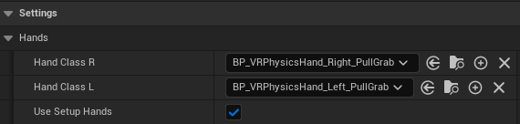

# Lumina Interaction Framework VR (LIFVR) Documentation

## 1. Getting Started

1. Enable this plugin in your Unreal Engine project under `Plugins -> LuminaInteractionFrameworkVR` (You will have to restart the engine after this).
2. Paste the predefined default project settings from the discord server to replace your project settings. This will ensure you have the collision channels and physical surfaces (materials) setup correctly in your project and also start with common settings for VR developement.

**Setup Project Settings:**
1. Navigate to your project folder.
2. Navigate into the folder `Config`: replace the `DefaultEngine.ini` and the `DefaultInput.ini` with the ones you can find here: [LIFVR Important Code](https://discord.com/channels/1197557737987518534/1197571941482111130).

### **How to find the LIFVR Content?**

To see the LIFVR Plugin content, be sure that the plugin is enabled in your project. Further you need to enable `show plugin content` in the settings of the content browser (right upper corner of the content browser). Than you should find the content of LIFVR with the base blueprint classes and examples under `Plugins/LIFVR Content`. 
To see the C++ classes you also need to enable `show C++ classes` in the settings of the content browser. The C++ classes can be found under `Plugins/LIFVR C++ Classes`.

**How to create your VR character?**

It's recommended to create child classes from the basic blueprint classes of LIFVR (like BP_HexaCharacter or BP_PhysicsHand_PullGrab_Right /_Left). You can also create your game classes directly from the C++ classes, but than you would need to setup the BP children and the settings yourself. In the basic BP classes everything is set up to work out of the box.

Create a child class of `BP_HexaCharacter`. It can be found under `Plugins/LIFVR Content/Blueprints/Core/Characters/HexaCharacter`.

You can configure the character to you're liking. Look into [LIFVR Character and Locomotion](/character.md) for more information about all settings, character data assets and general information about the character. 

**Optional: changing hand class of the character**

In this class in the details panel under `Settings->Hands` you can define which hand class you want to use. Any children classes from BP_VRPhysicsHand_Right (and the physics left hands) are compatible with the HexaCharacter. By default the hand classes: `BP_VRPhysicsHand_Right_PullGrab` and `BP_VRPhysicsHand_Left_PullGrab` are used. This is the same configuration as in the demo version. So if you want pull grab and everything like in the demo you don't need to change anything here.

 
### **Which hand class should I choose?**

It's recommended to use one of the hand classes:
- **BP_VRPhysicsHand_PullGrab_Right/_Left** or BP_VRPhysicsHand_Right/Left (without pull grab). To make changes create a child class of one of these classes and asign you're new class in the character `Hand Class R` and `Hand Class L`.

- If you want to create a completely own version of the hand or don't need physical hands, you can use the BP_VRHand_right/_left class as parent.

- (Experimental: The class BP_VRPhysicsControlHand is still experimental and not finished / stable yet!)

Choose the hand classes for the right (R) and left hand (L) in the drop down menu in you're character class in the variables `Hand Class R/L`. You can find it in the character details panel under `Settings -> Hands`. Let `bUSeAutoSetup = True` (checked) so they are automaticly setup.

### **Setting up the core**

LIFVR has it's own game mode: **BP_LuminaGameMode**. This should be the default game mode in you project. Otherwise you can set it in the world settings.

In **BP_LuminaGameMode** are already the standard classes setup:

- Default Pawn Class: **BP_HexaCharacter** <- Change this to you're child character class.
- Player Controller Class: **LuminaPlayerController**

The game instance to use is: **BP_LuminaGameInstance**. In it are the Settings object as well as the TagConfig object loaded and saved.

