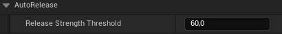
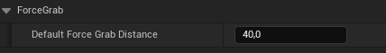

# Lumina Interaction Framework VR (LIFVR) Documentation

All questions about configuring grabable and interactible objects have a look here: [Grabbing and Interactions with objects](/interactions.md).
There is explained how to setup grabable objects, fixed grab poses and animation types, loose grabbing, index/middle grab, surface animations and grab circle with modes and much more.
- [Collision Solver Component](/interactions.md/#40-collision-solver-component)
- [Grabbing](/interactions.md/#41-grabbing)
    - [Grab Handler Component](/interactions.md/#411-grab-handler-component)
    - [Interaction Component](/interactions.md/#412-interaction-component)
- [Pull Grab](/interactions.md/#42-pull-grab)

## 3. VR Physics Hands

---

### _Table of Contents_
---
>:running: [Overview of VR Physics Hands](#30-Overview-of-VR-Physics-Hands)

>:gear: [Hand Settings](#Hand-Settings)

>:gloves: [How to change the hand skeletal mesh to a custom hand mesh?](#31-How-to-change-the-hand-skeletal-mesh-to-a-custom-hand-mesh)

>:raised_hand: [How to change the default hand animations?](#32-How-to-change-the-default-hand-animations)

---

In this section we will give an overview how the physics hand work in LIFVR and how to change the hand mesh and default animations to custom ones.

> [!IMPORTANT]
> You don't need to know or understand how the hands work to use them! If you simply want to use them as thay are, look at the chapter: [Grabbing and Interactions with objects](/interactions.md). This section [Overview of VR Physics Hands](#30-Overview-of-VR-Physics-Hands) describes more in depth how the hands itself work and are only necessary for people who want to change more deeper things in the hands or create more custom own hands based on the LIFVR hands!

#### **Hand Settings**

There are a few general settings with which you can customize the hands.

- **Disable / Enable effects when changing to grab with index and middle fingers grab, while already grabbing an object**:
    By default the grab feedback is also played if switching to both grab if before grabbing with the index grab (loose grab). 

    You can disable this by unchecking the following variable:

    

    The grab effects will then only be played on the first initial grab.    

- **Haptic Feedback**:
    Define the general haptic feedback of the hands or block them completely here:

    

    Note these effects are used for the basic poser grabbing and if no custom object haptic feedbacks are defined. If haptic feedback is defined in the interraction component of an actor these ones are overriden.

- **Sound Effects**:
    You can define the default sounds to be played if grabbing or releasing an object. These are only player if no custom item sounds are defined.

    

- **Auto Release Threshold**:
    You can custiomize the strength threshold for auto releasing objects. Higher means the hands are holding the object tighter and it needs more force to trigger the auto release of the object.

    

- **Force Grab Distance**:
    If an object was pull grabbed and normal grabbing did not work, the hasnds automaticly do force grab. This enables to easier catch pull grabbed actors. The force grab does fewer checks for grabbing and searches for objects in a larger distance than normal grabbing. You can allow a larger allowed grab distance for force grab by increasing the following variable:

    

### 3.0 Overview of VR Physics Hands

The (physics) hands can be found in the content browser under: `Plugins/LIFVRContent/Blueprints/Core/Characters/Hands/EnhancedHands`.

> [!NOTE]
> When opening the hands blueprint the first time the engine editor needs some time to load because there are many components defined from C++. Unfortunately this is a known issue in the UE Editor. After loaded once the BP and all other child blueprints will open faster. If you need to do changes often in the hands a workaround is to simply drag and drop a hand in you're current level while developing. In this way it's already loaded when opening it.

#### **Hand Classes Hierarchy**
---

The base parent class of all hands is the `VRHand` class. This hand class does physical grabbing but has no physical connection to the character. **This class is not intended to be used with the BP_HexaCharacter!**.

The `VRPhysicsHand` class (`BP_VRPhysicsHand_Right`) is the basic hand class for all fully physical hands and working with the `BP_HexaCharacter` and the corresponding `BP_PhysicsRig`.

The left hand `BP_VRPhysicsHand_Left` is a child of the right hand `BP_VRPhysicsHand_Right`. The variable `EVRHandType HandType = left / right` defines if it is a left or right hand. Left hands are constructed from the the right hand sk mesh, so you only need to create animations for the right hand skeleton and they will work for the other hand as well.

The hands have all child versions with the `pull grab component` added, enabling these hands to perform pull grabbing.

> [!IMPORTANT]
>The physics control hands (`BP_VRPhysicsHand_Right/Left_PhysControl`) in the `PhysicsControl` folder are experimental!

#### **VR Physics Hands**
---

The fully physics hands are physically constraint to the motion controller as well as to the Physics Rig of the HexaCharacter. If grabbing something there is also a physically connection created between the hands and the grabbed object. In this way we can have a physically hand strength, which leads to really feeling the weight of objects in VR. You can visual the difference between the motion of the motion controllers and the hands by setting the `Ghost Hands` to visible in the main menu. The Ghost Hands follow the motion controller instantly. This can be helpful for developement, to adjust thinks like the auto release threshold or custom strenght adjustements or debugging.

**Strenght switch**

To have more control over the impact and interaction the hands use a strength switch. For grabbed actors with a `GrabHandlerComponent` or `InteractionComponent` and the setting `UseStrengthSwitchOnCollision` enabled. The strength of the constraint to the motion controller is increased, to have a less woobly feeling and following better the motion controllers. On collisions with the hands or grabbed actors it is decreased again. You can customize this physical strength for each actor further in these two components (see: [here](/interactions.md)).

**Connection to the character body (PD switch)**

Furthermore does the connection to the Physics Rig of the HexaCharacter lead to a two way interaction between the charcter and its hands. The hands influence the motion of the character and the other way around. 
Because of this you can for example climb physically out of the box. Because sometimes the impact of the hands on the character is not wanted (can feel woobly) LIFVR has a PD switch integrated. If PD (parent dominates) is enabled in the physics constraint connecting the hand with the HexaRig the hands will have no impact on the character. If you grab something or the hands have collision with something than PD is disabled, so that you can interact with the world physically (all physics hands compatible with the HexaCharacter have `UsePD` enabled).

> [!NOTE]
>On the other side this physically connection obviously can lead to that the in game VR hands are not instantly following the motion controllers or are at another position (this is feeling the weight). If this is not suiting you, a fully physics based framework is maybe not the right choice for you're intentions.

**Collision Solver in Hands**

All physics hands have a collision solver component (see for more explenation: [Collision Solver Component](/interactions.md/#40-collision-solver-component)). You can get the current collision strength of the hands via this component events and methods. You can also detect in this way if there is a hard collision of the hands currently. By default if a hard collision occures to the hands haptic feedback is played. 

**Hand Components**

The VR Hand is constructed of many components to enable fully physics based interactions and a physical connection to the HexaCharacter (Hexa Physics Rig).All collision components of the hands belong to the collision channel: `VRHands`.
(This means if an actor should not collide with the hands you would need to ignore the VRHands channel in this actor.)

- **Collision Components:**
    The following components define the collision of the hand mesh. They are controlled and enabled via C++ code in the setup of the character.

    

- **Grabbing Location:**
    The Grabbing Root defines the center location for grabbing. All grab positions (grab poser, aligner/interaction positions) are calculated based on the position of this component.
    

- **Grabbing Overlap Box:**
    Grabable actors are found when they are overlapping the `GrabCollisionBox`.
    Note that this means if you want to be able to grab something with a larger distance, you would need to increase this box. It only registers actors and components allowed within the GrabbingTraceProfile and blocks grabbing for components defined in GrabBlockingActor. This blocking mechanism is used for the Grab Blocking Component (See e.g. BP_BaseValveWheel).

    

- **Skeletal Hand Mesh:** 
    The visible Hand Mesh is defined in the SkeletalHandMesh Component.

    

    Every component attached to this component will move with the visible hand.
    For custom hands, you can change this variable to a custom SK Mesh (Note: only SK Meshes wiith the same skeleton as the default UE5 hand skeleton are supported). 

### 3.1 How to change the hand skeletal mesh to a custom hand mesh

> [!IMPORTANT]
>A custom skeletal Hand Mesh needs to share the skeleton with the default UE5 hand skeleton (as the default hands of LIFVR). In this way you can simply change the SkeletalHandMesh Component in the VR_Hand. Than everything should work out of the box. 

To create custom hands its recomended to create children BPs from a hand class in LIFVR (e.g. BP_VRPhysicsHand_Right/Left_PullGrab) and
switch the skeletal mesh in the SkeletalHandMesh Component.

- If collisions seems to be odd with the new custom mesh, try to adjust the collisions components in the hand to fit the custom mesh (normally they should adjust them correctly automaticly (based on the finger bone locations))

- If you have issues with the basic poser with the new custom mesh, try to adjust the splines in you're hand BP to be similar as in the default LIFVR hands.

> [!NOTE]
>In principle if you want to use a hand mesh, which has not the UE5 hand skeleton you need to do some steps to change the SK mesh to fit to the UE5 hand skeleton. You can for example use the new Skeletal Editor of the UE5. Convert the custom SK mesh to a static mesh and then back to a SK Mesh with asigning the UE5 hand skeleton. Afterweards you need to do weight painting again so that the custom mesh works fine with the new skeleton.

> [!NOTE]
>For the left hand you can either create a child of a LIFVR left hand class and change again the SK Mesh in there. If you need to do more changes of components in the custom hands, I would suggest to creat the right hand class and adjust everything in there. Afterwards create a child of this new right hand BP and set the `HandType = Left`. 

> [!NOTE]
>Don't forget to change the hand classes (right/left) in the BP_HexaCharacter to the new hand blueprint with the custom mesh! (See: [Character](/character.md))

### 3.2 How to change the default hand animations

The hand animations are defined in the dataset `DA_DefaultHandAnims` (child of HandAnimControlDA (C++ class)) in the content browser under `LIFVR Content/Animations/Hands/AnimationsData`. These animations are used for the default posing. You can duplicate this dataset and customize the animations with your own animations. For the posing with interaction points and solver the `DA_DefaultInteractionStaticAnims` dataset is used, if no custom static animation DA is defined in an interaction point. 

How to use custom animations:
-----

1. **Data Asset: DA_DefaultHandAnims**:  Create a Data Asset (child of HandAnimControlDA) and define in there the hand animations (poses) you want to use. You only need to define the animations for the **Basic** and **StaticAnimation** grab type. 

2. **Hand Animation Blueprint (ABP_VRHandAnimation)**: Change the dataset variable `AnimationData` in the hand animation blueprint: `ABP_VRHandAnimation` to your newly created Data Asset.  

    

------

Default Hand Animation Data Asset (DA_DefaultHandAnims):
------

| Hand State Animation | Description                                                                       |
|----------------------|-----------------------------------------------------------------------------------|
| **Opened**           | Animation if touch inputs of controller buttons or thumbsticks are triggered       |
| **Idle**             | Animation if no controller input                                                  |
| **Grabbed**          | Animation if fully triggered trigger and grip buttons                             |
| **Loose Grabbing**   | Additional animation which can be used for custom modes to have more control over loose grabbing (not used in default mode) |
| **Grasping**         | Animation if possible to grab an object                                           |

