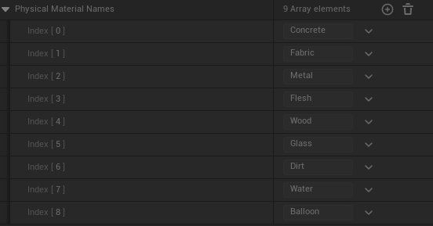
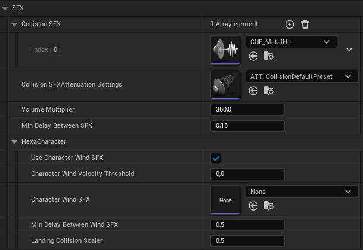

# Lumina Interaction Framework VR (LIFVR) Documentation

## 5. Collision profiles, physical materials, impact effect component

### 5.1 Impact Effect Component

With the **Impact Effect Component** you can create different effects like sound effects (SFX), visual effects (VFX) (Niagara Effects) and decals on impact hits.

Thhis component uses the collision strength of the impact to define if a VFX or SFx should be played. 

| Variable                    | Type  | Description                                                                                       |
|-----------------------------|-------|---------------------------------------------------------------------------------------------------|
| Complete Ignore Velocity    | float | Effects will only be played if the collision strength exceeds this threshold.                     |
| Use Only Delay Between Hits | bool  | This is an alternative mode. Example usage in **BP_MovableCubeBase**.                             |
| Debug Mode                  | bool  | Enable debug messages for this component. The current collision strength will be displayed.       |

Sound effects
----

To play an impact sound you simply need to define the sound effect which should be played in the `Collision SFX array` ( `+` icon to add a new element in the array). The sound will be played if the collision strength exceeds the complete ignore velocity threshold. The volume of the sound scales by the collision strength. You can adjust this with the `Volume Multiplier`. In LIFVR default `physical materials` are setup. To use these you can simply copy and paste the `DefaultEngine.ini` in you're project:
1. Navigate to your project folder.
2. Navigate into the folder `Config`: replace the `DefaultEngine.ini` with the one you can find here: [LIFVR Important Code](https://discord.com/channels/1197557737987518534/1197571941482111130).

> [!IMPORTANT]
> You need to order the effects in the array in the same order of the physical surfaces in the project settings. So e.g. if you want to set a sound effect for wood and wood is the fifth element in the project settings -> physical surface you need to set the effect as fifth element of the array (index = 4).

This will automaticly set the prepared physical surfaces (materials). Alternatively you can set them manually in the project settings: `Physics -> Physical Surface`. More information about the `physical materials`: see [here].

You can define a different sound for each physical surface by adding them in the `Collision SFX array`. You can rename and change the physical surfaces (materials) in your project as you like, the only important thing here is to set the effects into the right index of the array. They must match the order of the physical surfaces in your project. The default order can be viewed in the variable `Physical Material Names`.

> [!TIP]
> If you want to use one effect for all physical surfaces or without using these at all, you can simply set only the first array element (index = 0). It will use this effect for all physical surfaces.

> [!NOTE]
> Currently the component can only check the physical surfaces if you defined them in the materials of the primitive components/meshes. I'm working on an update in which you can also set up the physical materials by using the physical material overrides.

**Sound Effect Settings:** 
| Variable                        | Type   | Description                                                                                                       |
|---------------------------------|--------|-------------------------------------------------------------------------------------------------------------------|
| Collision SFX                   | Array of Sounds (USoundBase) | Array containing the sounds to play ordered like the physical surfaces in the project settings. Default: index 0. |
| Collision SFX Attenuation Settings | String | Attenuation setting for all sound effects. (Default: you can use **ATT_CollisionDefaultPreset**).                 |
| Volume Multiplier               | float  | Multiplier to scale additionally to the collision strength the absolute volume.                                   |
| Min Delay Between SFX           | float  | This time needs to be between two hits to play the sound. If a hit occurs in between, it will not be played.      |

#### Sound Effects for the  Hexa Character
---

Moreover this component can be also used for character sound effects: 
 1. **Sound on landing** after falling or jumping. It uses the default body hit sound defined in the `Collision SFX array` variable in the **HexaPhysicsRig**.
 2. **Wind sound** if character velocity exceeds a threshold.

> [!NOTE]
> A threshold `FastVelocityThreshold` to define fast velocities is already in the LuminaVRMovementComponent under  `Settings -> Locomotion -> Velocity` of the wind sound. So this velocity has always be exceeded to trigger the `FastVelocityUpdate` delegate / event dispatcher. The variable `Character Wind Velocity Threshhold` in this component can be used to further adjust it explicit for the sound.

> [!NOTE]
> LIFVR provides currently no wind sound effect. You need to add your own in the `Character Wind SFX` variable.

**Settings For Character Sound:**

| Variable                            | Type        | Description                                                                                              |
|-------------------------------------|-------------|----------------------------------------------------------------------------------------------------------|
| Use Character Wind SFX              | bool        | Enable or disable the wind effect.                                                                       |
| Character Wind Velocity Threshold   | float       | Additional threshold for the velocity to play the sound besides `FastVelocityThreshold` in the LuminaVRMovementComponent. |
| Character Wind SFX                  | USoundBase  | Sound to play for wind movement effect.                                                                  |
| Min Delay Between Wind SFX          | float       | This time has to be elapsed before the next sound can be played.                                         |
| Landing Collision Scaler            | float       | Here you can scale the collision strength threshold explicitly for the landing sound effect.             |

Visual effects
----

Decals
----

