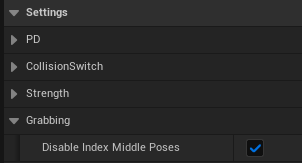

# Lumina Interaction Framework VR (LIFVR) Documentation

## 4. Interactions with objects
### 4.0 Collision Solver Component
This component handles more complex collisions between actors, like "soft/normal" collisions (will fire every custom tick (defined in variable: ) as long the collision is occurung / the actor touches another object) or hard collision (fires once if a threshold of the collision strength is hit) and also registers the end of the collision (fires once). (Note: The end of the collision is not completely stable and sometimes chaos collision ends are missed to track. Hope this gets better with the developement of chaos, but also work in progress to improve this).

> **_Important:_** At least one primitive component in the actor needs to simulate physics, has collision enabled and `Simulation Generates Hit Events`  enabled. Otherwise the collision solver can't track collisions and the events will not fire.

it gives access to the following events:

| Event Category          | Event Name                   | Description                                                                      | Outputs                                                                                     |
|-------------------------|------------------------------|----------------------------------------------------------------------------------|---------------------------------------------------------------------------------------------|
| **Actor Collisions**    | **On Actor Colliding**       | Continuously fires as long as the actor collides (soft/normal).                  | - Other Actor<br>- Current Collision Strength                                                |
|                         | **On Actor Hard Colliding**  | Fires once each time the collision strength exceeds the `HardCollisionThreshold`.| - Other Actor<br>- Current Collision Strength                                                |
|                         | **On Collision Ended**       | Fires once when the actor is no longer colliding.                                | None                                                                                        |
| **Component Collisions**| **On Component Colliding**   | Fires if a specified component in `ComponentsNameArray` is colliding, when `UseComponentsHit = True`. | - Other Actor<br>- Colliding Component<br>- Current Collision Strength                      |
|                         | **On Component Hard Colliding** | Fires if a specified component in `ComponentsNameArray` is hard colliding (above hard collision threshold), when `UseComponentsHit = True`. | - Other Actor<br>- Colliding Component<br>- Current Collision Strength                      |
|                         | **On Component Collision Ended** | Fires if a specified component in `ComponentsNameArray` is no longer colliding, when `UseComponentsHit = True`. | - Colliding Component                                                                       |

**Output description**

- **Other Actor**: The other actor involved in the collision. This output identifies which actor is colliding with the subject actor or component.
- **Colliding Component**: The component of this actor that triggers the collision event. This is particularly useful for understanding which part of the actor is involved in the collision.
- **Current Collision Strength**: Indicates the intensity of the collision at the moment of the event. Higher values represent stronger impacts.
- **Colliding Component (On Component Collision Ended)**: Specifies which component of the actor has stopped colliding, providing clarity on which part of the interaction has concluded.


**Settings**


**Component Hits**

In complex actors you can also define which components should fire the collision events, so that not all primitive components with collision enabled are tracked by this component. 

This is for example used to track only some body part collisions of the HexaPhysicsRig for the HexaCharacter (otherwise the locomotion sphere would always fire the collision event).

In the details panel of clicked on the Collision Solver Component in the actor -> Settings -> ComponentsHit:

- ```UseComponentsHit = True```

- In the ```ComponentsNameArray``` you can write all the names of the components of this actor for which it should track the collisions.


### 4.1 Grabbing

To enable grabbing of an actor you need to follow the following simple steps:

1. **Simulate physics**: Ensure the actors root component or at least one primitive component (e.g. static or skeletal meshes) in the actor has simulation enabled. This means in the details panel of the component under `Physics` -> `Simulate Physics` needs to be checked.

2. **Collision**: Ensure the simulating actor component has collision enabled (query and physics) and is from object type `PhysicsBody`. You can simply use the collision preset `PhysicsActor`. (For grabbing it's important that it blocks the collision channel VRHands).

    - If you want to use the dynamic finger adjustements on the surface of the object it is necessary to enable `Generate Overlap Events` in the collision section.

3. **Grab Tag**: Add the grab tag (default: **grab**) to the actor as actor tag. (You can change the tag value names in DA_TagConfig (see [introduction](/introduction.md))).


> **_Important:_**> It's important to add the tag in the actor (**actor tag**) and not in the component. This is because the VR Hands show indicators if grabbing is possible, like the grab circle and a hand animation. To have a better performance the actor tag is used instead of a component tag. In this way it does not need to check each component in the actor if grabbing is possible in tick loop.

4. **Add the grab handler component**: The hands do automatic adjustements while grabbing an object. For this it's recommended to add the grab handler component. Furthermore for this enable `Simulation Generates Hit Events` in the collision section of the physical component(s) of the actor. (It's a child of the collision solver, so you have access to all features of this component (see more info in the section above)).

The grab handler component manages the strength switch of the hands which is used that the physical hands follow more precise the motion controller motions without beeing to strong on collisions with other objects. In the grab handler is a event dipatcher (event) for **OnGrabbed** and **OnReleased**. It enables further settings for grabbing like for example object specific grab sounds and haptic feedback when the object collides hard (or on any collision).

Through the grab handler component you also have a reference to the hand which is currently grabbing the actor. You only need to call the function `GetGrabHands()` or `GetGrabbedHandWithType(EVRHandType HandType)`.


Further useful methods of the grab handler are shown in the following image:


**Different Configurations for grab actors**

| Option | Features and Description                                                                                                                                                                                                                                                         | Benefits                                                 | Example Actors                                   |
|--------|------------------------------------------------------------------------------------------------------------------------------------------------------------------------------------------------------------------------------------------------------------------------------------|----------------------------------------------------------|--------------------------------------------------|
| Option 0: Only use Grab Tag without any component | - Only simple grabbing with index or middle pose<br>- No advanced hand physics or interaction logic<br>- Suitable for static objects where complex interactions are not needed                                                                                                            | Ideal for simple, static interactions like climbing walls | Climbing Walls, BP_Slingshot, BP_Pipe_Straight     |
| Option 1: Only use the Grab Handler component     | - Different poses for index/middle grab<br>- Haptic feedback on object collisions<br>- Override of grab/release sound<br>- Override of collision profile while grabbing<br>- Events on grab/on release<br>- Only basic poser for hand poses<br>- Advanced control of hand strength | Enables precise control over grip strength and simple hand poses. | BP_MetalPot                     |
| Option 2: Only use the Interaction Solver with interaction points | - Custom poses<br>- Events for button presses while grabbing (interactions)<br>- Loose grabbing system<br>- Advanced settings for hand physics<br>- Grab circle mode                                                                                                                   | Offers custom poses and a flexible grabbing system, ideal for more complex interactions. | BP_Drawer, BP_Locker     |
| Option 3: Use both components                     | - Combines the features of Option 1 and Option 2                                                                                                                                                                                                                                       | Leverages the advantages of both systems for comprehensive handling and interaction. | BP_SimpleGun, BP_Dagger |


### Grabbing types and loose grabbing
------

In LIFVR you can grab eather with the `grip button` or with the `trigger button` of the motion controller. For more information about the input mapping see [Enhanced Inputs](character.md). If a grab was induced by the trigger button it's called **index grab**, because only the index finger and the thumb grabs the object.  If it was induced with the grip button it's called **middle fingers grab** (or middle grab), because the middle fingers and the thumb are holding the object. **Both grab** means the trigger button and the grip button are pressed. This state is saved in the `GrabType` variable:


### Grabbing Animations / Poses
------

The hand animation blueprint is `ABP_VRHandAnimation` and can be found in `Plugins/LIFVR Content/Blueprints/Animations/Hands`. The animations are based on the states:
- IsGrabbing -> Grabbing state
    - GrabType (IsIndexGrab, MiddleFingersGrab, BothGrab)
- CanGrab -> Gasping state

Further it drives an overlay of surface finger animation if not grabbing anything (see more in the section below).


By default the hands use a simple tracer poser to create automaticly a grabbing pose. Furthermore it uses different grab poses for **index, middle fingers and both grab**. One can disable this in the **GrabHandlerComponent** with setting the variable `Disable Index Middle Poses = True` in the Grab Handler component details panel under `Settings -> Grabbing`.



### Animations with interaction points
-----

With interaction points and the interaction solver you can choose between different **animation modes** for grabbing:

- **Aligner Animation**: Here you don't need any predefined animations. You can directly set the finger curl values in the BP_Aligner component with a visual hand representation in the viewport.

- **Static Animation**: You can define fixed animations, which you need to have already created and saved in a data asset of the type **HandAnimControlDA** (`Plugins/LIFVR Content/Blueprints/Animations/Hands/AnimationsData`).
- **Basic Poser**: The default basic tracer poser.

> **_Note:_**> You always only need to create animations for the right hand and they will automaticly work as well for the left hand.

<p>


<p>

### Grabbing indicators (grab circle and animations)
------

### How can I block grabbing of specific components in an actor or areas?
------

> **_Important:_**> By default the entire actor can be grabbed (any component with physics and generate overlap events enabled).

One option to block grabbing is to use the **BP_GrabBlockerArea** (`Plugins/LIFVR Content/Blueprints/Interactions/BlockingAreas`). You can simply add this component in you're actor or in the level, choose a geometry for the component and place it at the location you want. Everything in this area can not be grabbed anymore. This is independent of the grabbing type or option used. So it works for the basic poser without any component as well as for interaction points. 

### 4.1.1 Grab Handler Component
grab handler component (more precise control and strength switch, feeling weights)
This component is a children of the collision solver component, so all events and methods as described in subsection **4.0 Collision Solver Component** can be accessed from this component. It is recommended to use the collision solver component for all actors, so if you have a grab able actor only use this Grab Handler Component instead of the Collision Solver Component.

The Grab Handler Component enables precise control of the grabbing of actors. Because it also handles the strength of the VRPhysicsHands dynamically to feel right in all situations and there impact on the physics character this component should be added to all grab able actors. It also let you access the following events:

    - 

### 4.1.2 Interaction component
How to use it, needed components: interaction solver component, aligner components, aligner poses, dev tools: visualising flip/mirror preview, using gizmos, two hand stuff, physical settings, how to use button inputs,..

### 4.2 Pull Grab
