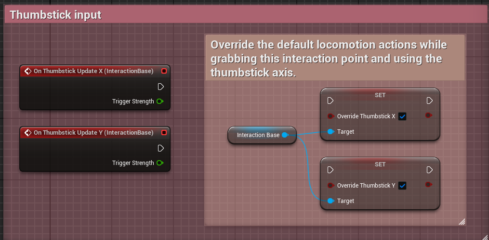
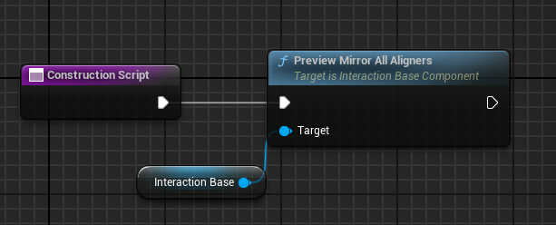

# Lumina Interaction Framework VR (LIFVR) Documentation

## 4. Interactions with objects
---

### _Table of Contents_
---
>:collision: [Collision Solver Component](#40-collision-solver-component)

>:raised_hand: [Grabbing](#41-grabbing)

>>:gloves: [Grab Handler Component](#411-grab-handler-component)

>>:point_up_2: [Interaction Component](#412-interaction-component)

>:magnet: [Pull Grab](#42-pull-grab)
---


### 4.0 Collision Solver Component
This component handles more complex collisions between actors, like "soft/normal" collisions (will fire every custom tick (defined in variable: ) as long the collision is occurung / the actor touches another object) or hard collision (fires once if a threshold of the collision strength is hit) and also registers the end of the collision (fires once). (Note: The end of the collision is not completely stable and sometimes chaos collision ends are missed to track. Hope this gets better with the developement of chaos, but also work in progress to improve this).

> [!IMPORTANT]
> At least one primitive component in the actor needs to simulate physics, has collision enabled and `Simulation Generates Hit Events`  enabled. Otherwise the collision solver can't track collisions and the events will not fire.

> [!NOTE]
> If an actor with skeletal mesh does not trigger the collision events of the collision solver component even with `Simulation Generates Hit Events` enabled, make sure this is also checked in the physics asset of this component in the collision section.

it gives access to the following events:

| Event Category          | Event Name                   | Description                                                                      | Outputs                                                                                     |
|-------------------------|------------------------------|----------------------------------------------------------------------------------|---------------------------------------------------------------------------------------------|
| **Actor Collisions**    | **On Actor Colliding**       | Continuously fires as long as the actor collides (soft/normal).                  | - Other Actor<br>- Current Collision Strength                                                |
|                         | **On Actor Hard Colliding**  | Fires once each time the collision strength exceeds the `HardCollisionThreshold`.| - Other Actor<br>- Current Collision Strength                                                |
|                         | **On Collision Ended**       | Fires once when the actor is no longer colliding.                                | None                                                                                        |
| **Component Collisions**| **On Component Colliding**   | Fires if a specified component in `ComponentsNameArray` is colliding, when `UseComponentsHit = True`. | - Other Actor<br>- Colliding Component<br>- Current Collision Strength                      |
|                         | **On Component Hard Colliding** | Fires if a specified component in `ComponentsNameArray` is hard colliding (above hard collision threshold), when `UseComponentsHit = True`. | - Other Actor<br>- Colliding Component<br>- Current Collision Strength                      |
|                         | **On Component Collision Ended** | Fires if a specified component in `ComponentsNameArray` is no longer colliding, when `UseComponentsHit = True`. | - Colliding Component                                                                       |

**Output description**

- **Other Actor**: The other actor involved in the collision. This output identifies which actor is colliding with the subject actor or component.
- **Colliding Component**: The component of this actor that triggers the collision event. This is particularly useful for understanding which part of the actor is involved in the collision.
- **Current Collision Strength**: Indicates the intensity of the collision at the moment of the event. Higher values represent stronger impacts.
- **Colliding Component (On Component Collision Ended)**: Specifies which component of the actor has stopped colliding, providing clarity on which part of the interaction has concluded.


**Settings**


**Component Hits**

In complex actors you can also define which components should fire the collision events, so that not all primitive components with collision enabled are tracked by this component. 

This is for example used to track only some body part collisions of the HexaPhysicsRig for the HexaCharacter (otherwise the locomotion sphere would always fire the collision event).

In the details panel of clicked on the Collision Solver Component in the actor -> Settings -> ComponentsHit:

- ```UseComponentsHit = True```

- In the ```ComponentsNameArray``` you can write all the names of the components of this actor for which it should track the collisions.


### 4.1 Grabbing

To enable grabbing of an actor you need to follow the following simple steps:

1. **Simulate physics**: Ensure the actors root component or at least one primitive component (e.g. static or skeletal meshes) in the actor has simulation enabled. This means in the details panel of the component under `Physics` -> `Simulate Physics` needs to be checked.

2. **Collision**: Ensure the simulating actor component has collision enabled (query and physics) and is from object type `PhysicsBody`. You can simply use the collision preset `PhysicsActor`. (For grabbing it's important that it blocks the collision channel VRHands).

    - If you want to use the dynamic finger adjustements on the surface of the object it is necessary to enable `Generate Overlap Events` in the collision section.

3. **Grab Tag**: Add the grab tag (default: **grab**) to the actor as actor tag. (You can change the tag value names in DA_TagConfig (see [introduction](/introduction.md))).


> [!IMPORTANT]
> It's important to add the tag in the actor (**actor tag**) and not in the component. This is because the VR Hands show indicators if grabbing is possible, like the grab circle and a hand animation. To have a better performance the actor tag is used instead of a component tag. In this way it does not need to check each component in the actor if grabbing is possible in tick loop.

4. **Add the grab handler component**: The hands do automatic adjustements while grabbing an object. For this it's recommended to add the grab handler component. Furthermore for this enable `Simulation Generates Hit Events` in the collision section of the physical component(s) of the actor. (It's a child of the collision solver, so you have access to all features of this component (see more info in the section above)).

The grab handler component manages the strength switch of the hands which is used that the physical hands follow more precise the motion controller motions without beeing to strong on collisions with other objects. In the grab handler is a event dipatcher (event) for **OnGrabbed** and **OnReleased**. It enables further settings for grabbing like for example object specific grab sounds and haptic feedback when the object collides hard (or on any collision).

Through the grab handler component you also have a reference to the hand which is currently grabbing the actor. You only need to call the function `GetGrabHands()` or `GetGrabbedHandWithType(EVRHandType HandType)`.


Further useful methods of the grab handler are shown in the following image:


**Different Configurations for grab actors**

| Option | Features and Description                                                                                                                                                                                                                                                         | Benefits                                                 | Example Actors                                   |
|--------|------------------------------------------------------------------------------------------------------------------------------------------------------------------------------------------------------------------------------------------------------------------------------------|----------------------------------------------------------|--------------------------------------------------|
| Option 0: Only use Grab Tag without any component | - Only simple grabbing with index or middle pose<br>- No advanced hand physics or interaction logic<br>- Suitable for static objects where complex interactions are not needed                                                                                                            | Ideal for simple, static interactions like climbing walls | Climbing Walls, BP_Slingshot, BP_Pipe_Straight     |
| Option 1: Only use the Grab Handler component     | - Different poses for index/middle grab<br>- Haptic feedback on object collisions<br>- Override of grab/release sound<br>- Override of collision profile while grabbing<br>- Events on grab/on release<br>- Only basic poser for hand poses<br>- Advanced control of hand strength | Enables precise control over grip strength and simple hand poses. | BP_MetalPot                     |
| Option 2: Only use the Interaction Solver with interaction points | - Custom poses<br>- Events for button presses while grabbing (interactions)<br>- Loose grabbing system<br>- Advanced settings for hand physics<br>- Grab circle mode                                                                                                                   | Offers custom poses and a flexible grabbing system, ideal for more complex interactions. | BP_Drawer, BP_Locker     |
| Option 3: Use both components                     | - Combines the features of Option 1 and Option 2                                                                                                                                                                                                                                       | Leverages the advantages of both systems for comprehensive handling and interaction. | BP_SimpleGun, BP_Dagger |


### Grabbing types and loose grabbing
------

In LIFVR you can grab eather with the `grip button` or with the `trigger button` of the motion controller. For more information about the input mapping see [Enhanced Inputs](character.md). If a grab was induced by the trigger button it's called **index grab**, because only the index finger and the thumb grabs the object.  If it was induced with the grip button it's called **middle fingers grab** (or middle grab), because the middle fingers and the thumb are holding the object. **Both grab** means the trigger button and the grip button are pressed. This state is saved in the `GrabType` variable:


### Grabbing Animations / Poses
------

The hand animation blueprint is `ABP_VRHandAnimation` and can be found in `Plugins/LIFVR Content/Blueprints/Animations/Hands`. The animations are based on the states:
- IsGrabbing -> Grabbing state
    - GrabType (IsIndexGrab, MiddleFingersGrab, BothGrab)
- CanGrab -> Gasping state

Further it drives an overlay of surface finger animation if not grabbing anything (see more in the section below).


By default the hands use a simple tracer poser to create automaticly a grabbing pose. Furthermore it uses different grab poses for **index, middle fingers and both grab**. One can disable this in the **GrabHandlerComponent** (or **Interaction base component** (interaction point)) with setting the variable `Disable Index Middle Poses = True` in the Grab Handler component details panel under `Settings -> Grabbing` (or in the interaction point `Settings -> Animations`).


Further by default the thumb will be locked to the defined grab pose (in both aligner and static animation mode). If you want to enable that the thumb reacts to button touches while grabbing, you can set `LockThumbPose = False` in the Grab Handler component (or interaction point) details panel under `Settings -> Grabbing` (or in the interaction point `Settings -> Animations`).

> [!IMPORTANT]
> If an actor has an interaction point and grab handler the variables of the interaction point are always prioritized and will override the ones in the grab handler component.

There exist different general grab types for the VR (Physics)Hands which drive different logic mainly based on the different animation methods. The general grab types are:

- **Basic**: This is the grabbing with the basic poser
- **Interaction Grab**: This is grabbing with interaction points and aligner animation mode. (here poses defined in the aligner component)
- **Static Animation Grab**: This is grabbing with interaction points and static animation mode. (here poses defined in a animation data asset).
- **IK Grab** (Experimental): This is grabbing via a control rig of the hands. This grabbing type is still experimental and not yet polished!
- **Physics Grab** (Not implemented yet): This type is already prepared for the experimental physics control hands, but not yet implemented.

The correct modes are automaticly chosen by the grabbing interaction (e.g. with interaction points) or default **Basic**. If you want to try the IK Grab you can set the grab type in the hands blueprint.

The default hand animations are defined in the **DA_DefaultHandAnims** data asset (type: HandAnimControlDA). It can be found in the content folder: `Plugins/LIFVR Content/Animations/Hands/AnimationsData`. You can change the animations in the slots of this data asset, but it's important that the animations are for the **SK_MannequinsXR** skeleton or retargeted to it.

- **Opened**: Animation used for animations if button touches are triggered (thumb (thumbstick touch, Button touch), index finger (trigger touch)).
- **Idle**: Idle pose if nothing is triggered.
- **Grabbed**: Normal grabbing pose.
- **LooseGrabbing**: Here you can define a custom pose while loose grabbing is active. (e.g. in interaction points with static animation grab).
- **Grasping**: Default grasping animation. (Can be overriden for specific actors/interaction points).

### Animations with interaction points
-----

With interaction points and the interaction solver you can choose between different **animation modes** for grabbing:

- **Aligner Animation**: Here you don't need any predefined animations. You can directly set the finger curl values in the BP_Aligner component with a visual hand representation in the viewport.

- **Static Animation**: You can define fixed animations, which you need to have already created and saved in a data asset of the type **HandAnimControlDA** (`Plugins/LIFVR Content/Blueprints/Animations/Hands/AnimationsData`).
- **Basic Poser**: The default basic tracer poser.

>**_Note:_** You always only need to create animations for the right hand and they will automaticly work as well for the left hand.

**Example actors:** 

| Animation Mode            | Example Actors                                | Subfolder                  |
|---------------------------|-----------------------------------------------|----------------------------|
| Aligner Animation       | BP_Dagger, BP_Crowbar    | `/Tools` |
| Static Animation          | BP_SimpleGun,                   | `/Tools/Weapons/`       |
| Basic Poser      | BP_Sledgehammer, BP_MetalPot   | `/Toys` `/Tools`  |

<p>


<p>

>[NOTE]
>For more information see [here](#412-interaction-component)

### Grabbing indicators (grab circle and animations)
------

LIFVR has two indicators which give feedback if an actor can be grabbed:

- Grab circle
- Grasping animation

**Grab circle**
The grab circle is a visualizer which is visible on the actor if it is possible to grab it. By default the circle appears on the nearest location to the hand on the surface of the grabable actor (**surface mode**). If the basic poser is used for grabbing this is the exact location where the skeletal hand mesh will attach if grabbing the actor. There are different grab circle modes. If an actor uses an interaction point (+ interaction solver component) you can choose the grab circle mode for this actor/interaction point:

| Mode      | Description                                       |
|-------------|----------------------------------------------------|
| Surface     | Grab circle shows on the surface of the object     |
| AttachPoint | Grab circle shows on the attach point for the hand (interaction points) |
| FixCenter   | Grab circle shows on the center of the object      |
| FlexCenter  | Grab circle is centered but movable (e.g., crowbar)|

It's also possible to disable the grab circle completely for an interaction point by setting the variable `UseGrabCircle` (interaction point: `Settings -> GrabCircle`). This is as an example in the **BP_DrawingBrush** the case.

**Grasping animation**

If using the static animation mode within interaction points you can set a different grasping pose for each interaction point/actor to override the default one forspecific actors. Set the grasping animation in the data asset (type:**HandAnimationControlDA**) with the static animations for this actor/interactionpoint.

### How can I block grabbing of specific components in an actor or areas?
------

> [!IMPORTANT]
> By default the entire actor can be grabbed (any component with physics and generate overlap events enabled). Ih you don't want that a component can be grabbed and you don't need `generate overlap events` disable it.

One option to block grabbing is to use the **BP_GrabBlockerArea** (`Plugins/LIFVR Content/Blueprints/Interactions/BlockingAreas`). You can simply add this component in you're actor or in the level, choose a geometry (static mesh) for the component and place it at the location you want. Everything in this area can not be grabbed anymore. This is independent of the grabbing type or option used. It is basicly intended for actors or parts of an actor in which the basic poser is used for grabbing (See example **BP_BaseValveWheel** or **BP_Hammer**).


### 4.1.1 Grab Handler Component
This component is a children of the collision solver component, so all events and methods as described in subsection **4.0 Collision Solver Component** can be accessed from this component. It is recommended to use the collision solver component for all actors, so if you have a grab able actor only use this Grab Handler Component instead of the Collision Solver Component.

The Grab Handler Component enables precise control of the grabbing of actors. Because it also handles the strength of the VRPhysicsHands dynamically to feel right in all situations and there impact on the physics character this component should be added to all grab able actors. It also let you access the following events:


You can access the currently grabbed hand by the method `GetGrabHands()` this returns an array of the hands reference (0: no hand currently grabbing, 1: one hand is grabbing, 2: both hands are grabbing). You can then get which hand is grabbing by calling the method `GetHandType()` (returns: left/right) of the hand reference. If you want to directly check if e.g. the right hand is grabbing the actor you can call the method `GetGrabbedHandWithType(HandType:right/left)` in the Grab Handler component instead. 


With the grab handler component the hand strenght is automaticly adjusted (strength switch) to have more control (following the motion controls more precicely) without beeing to strong on collisions with the grabbed actors. 

The grab handler component gives access to the following settings:


**Common settings:**
--
| Category           | Setting                      | Description                                                                                                                                         |
|--------------------|------------------------------|-----------------------------------------------------------------------------------------------------------------------------------------------------|
| **Grabbing**       | Disable Index Middle Poses   | If set to true, you can disable different poses when grabbing with middle fingers (grab button) or index finger (trigger button).                    |
|                    | Lock Thumb Pose              | By default, the thumb pose is fixed for grabbing (no changes on input touch event). You can enable the thumb pose to change dynamically by checking this boolean. |
| **GrabCollision**  | UseGrabCollisionProfile      | Set this to true if you want to change the collision profile of the actor while it's grabbed.                                                       |
|                    | Default Collision Profile    | If using grab collision profile, this is the default collision profile, normally set to *PhysicsActor*.                                             |
|                    | Grab Collision Profile       | The collision profile used while grabbing. Set it to *IgnoreHexaBody* to disable collisions between the grabbed actor and the character.            |
| **Sound**          | Grabbing Sound               | You can override the default grab sound by setting here an actor-specific grab sound.                                                               |
|                    | Releasing Sound              | You can override the default release sound by setting here an actor-specific release sound.                                                        |
| **Haptic Feedback**| Basic Collision Effect       | Triggers haptic feedback if the grabbed actor collides with another object (basic collision/touching another object). Continuously fired until the collision has ended.|
|                    | Hard Collision Effect        | Triggers haptic feedback if the grabbed actor collides hard with another object (hard collision). Fired once the collision strength reaches the hard collision threshold. |    

More information for the **Collision** and **ComponentsHit** settings can be found in subsection **4.0 Collision Solver Component**. 

**Advanced settings:**
--
| Category                    | Setting                             | Description                                                                                                                                 |
|-----------------------------|-------------------------------------|---------------------------------------------------------------------------------------------------------------------------------------------|
| **Collision Switch**        | SwitchStrengthOnCollision           | Disable the switch of the hand strength for this actor. This can lead to too much force on collisions with a grabbed actor. You can disable it if custom strength profiles are needed. |
| **Strength**                | Linear Strength Scale               | This multiplier adjusts the linear strength of the main physics constraint in the hand, influencing both normal grab strength and grab strength on collisions. |
|                             | Angular Strength Scale              | This multiplier adjusts the angular strength of the main physics constraint in the hand, influencing both normal grab strength and grab strength on collisions. |
| **Advanced Custom Strength**| Enable Override Hand Physics        | Required to use the following advanced custom strength settings.                                                                            |
|                             | Linear Collision Strength Scale     | Adjusts the linear strength specifically while the actor collides.                                                                          |
|                             | Angular Collision Strength Scale    | Adjusts the angular strength specifically while the actor collides.                                                                         |
|                             | Linear Grab Strength Scale          | Adjusts the linear strength specifically while grabbing the actor and not colliding.                                                        |
|                             | Angular Grab Strength Scale         | Adjusts the angular strength specifically while grabbing the actor and not colliding.                                                       |


**Experimental settings:** 
--

| Category | Setting                  | Description                                                                                                                                                 |
|----------|--------------------------|-------------------------------------------------------------------------------------------------------------------------------------------------------------|
| **PD**   | Activate Stabilize       | This will enable the second PD Constraint even if PD is disabled, leading to an increased impact of the Hexa Physics Rig.                                    |
|          | Linear Stabilize Amount  | Linear strength multiplier of the second constraint.                                                                                                        |
|          | Angular Stabilize Amount | Angular strength multiplier of the second constraint.                                                                                                       |
|          | Enable PD                | This will enable parent dominates while grabbing (this actor will have no impact on the hexa character). This is still experimental and can lead to unstable physics. |    

> **_Note:_** If `SwitchStrengthOnCollision` is disabled only the **Grab Strength** is used.

> [!IMPORTANT]
> When changing the strength scales it's important to have a descent ratio betweeen the linear and angular strength. If the angular strenght is too high compared to linear strenght, it can lead to strange behavior while grabbing. For example you can not freely move an actor if grabbed with both hands, because the angular strength prohibits it. So if you have cutomized strenght and experiences something like that, try to reduce the angular strength or increase the linear.

> [!IMPORTANT]
> To enable custom strength or use experimental settings of PD you need to enable `Override Hand Physics` first.

**Useful functions:**
--


### 4.1.2 Interaction component
------

How to use it, needed components: interaction solver component, aligner components, aligner poses, dev tools: visualising flip/mirror preview, using gizmos, two hand stuff, physical settings, how to use button inputs,..

The interaction system (consisting of the interaction base component, interaction solver component and Aligner component) enables even more control for grabbing and access to input events. It should be used whenever complex interactions are required.


| Component                      | Function              | Description                                                                                                                                                                                                                                                                                                        |
|--------------------------------|-----------------------|--------------------------------------------------------------------------------------------------------------------------------------------------------------------------------------------------------------------------------------------------------------------------------------------------------------------|
| **Interaction Base Component** | Interaction points    | Scene component to attach to components in an actor. You can have multiple interaction points in an actor.                                                                                                                                                                                                         |
| **Aligner Component**          | Hand visualizer       | Visualizer of the hand and specifying the exact transform to pose the hand on grab. If using Aligner animation mode, this also defines the animation pose by defining the finger data. Each interaction point needs at least one right hand aligner component (BP RightAligner). You can have multiple Aligners attached to one interaction point. |
| **Interaction Solver Component**| Management system     | Management system for all interaction points in an actor. Actor component, which manages the handling between the different interaction points in an actor, like returning the interaction point with highest priority to grab or to register if the actor is holding by two hands on different interaction points. You need one interaction solver component in each actor using the interaction system. |

## Guide to Use Interaction System

| **Step 1: Add the Interaction Solver Component** |
|--------------------------------------------------|
| Attach the **Interaction Solver Component** to your actor. |

| **Step 2: Set Up an Interaction Base Component** |
|--------------------------------------------------|
| Add an **Interaction Base Component** and attach it to the component you wish to be grabbable. This acts as one interaction point in your actor. Position it in the viewport at the location where interaction and grabbing should occur. If using `GrabCircleMode = Attach point`, this is where the grab circle will be drawn. |

| **Step 3: Configure a BP Right Aligner** |
|------------------------------------------|
| Attach a **BP Right Aligner** to the interaction base component. Move and rotate the aligner to fit how you want the actor to be grabbed by the hand. |

| **Step 4: Setup the Grab Pose** |
|---------------------------------|
| Choose between **Static Animation** and **Aligner Animation** for setting up the grab pose:<br>- **Static Animation:** Define an **Animation Data** data asset where the predefined animations are configured.<br>- **Aligner Animation:** Click on the aligner component, and under settings, adjust the finger value sliders to set up the pose. The hand visualizer will display the final grab pose. |

> [!IMPORTANT]
> With Interaction Points you don't need an additional `grab tag`. Then it will be only using the interaction points in the actor to grab. If you want to allow additional normal grabbing place again the `grab tag`. It will then use the interaction point if it close to it and allowed to grab there. Otherwise it will use the normal grabbing system. (See for an example **BP_SimpleGun**).

<p>


<p>


> [!NOTE]
> You can change the material of the aligner component in the details panel of it and use e.g the original hand material: **MI_Quinn_02** or any other material which suits you.

> [!TIPP]
> If using many aligners in one interaction point it can get confusing, but you can simply set the visibility of each aligner you don't need currently to adjust to false in their details panel.

**Interaction Point Grab Events**
--

You can use the following events which are triggered by grabbing or releasing the interaction point. You can find them in the interaction points details panel `Events`.


Furthermore each interaction points tracks the time since the grab of the interaction point occured. You can access it through `GetGrabDuration()` in the interaction point reference or adding the event: `OnGrabTimeUpdate` (continous update).


**Inputs**
--

The input events trigger, button presses, releases are passed to the interaction point events in which you can drive logic with them. 


You have also access to the thumbstick update values splitted to the x and y axis. You can override the default locomotion actions, which would be triggered through these inputs, while grabbing this interaction point and triggering the thumbstick inputs. Simply set the booleans `OverrideThumbstick X` and/or `OverrideThumbstick Y` to true. You can find these under `Settings -> Input -> Thumbstick` in the interaction base component.



**Further settings:**

For the inputs exist the following settings:


- **Time Thresholds:** Block the input actions for the specified time after grabbing of this interaction point starts. After this time has elapsed the input actions will fire normally. This is only blocked for the first grab of this interaction point not the second one if both hand grab is enabled for this interaction point. (This is for example used in the **BP_SimpleGun** to prevent shooting accidentally on grab).

- **Use Trigger Strength Threshold**: For the trigger input you can additionally define to use a strenght threshold. The Trigger pressed event will only fire once if the trigger is pressed strong enough. The continous trigger event will not be changed by this setting (see **BP_SimpleGun**).

**Useful functions**
--


**Mirroring Left Hands**
--

You can only setup the right aligner and use `Mirror All Right Hands = true`. Ensure the `Mirror Aligner Class` is set to **BP_LeftAligner**. For normal mirroring of the left hand let `HandMirrorFixedPosition = None`. If you want to have other mirroring axes you can choose one.


You can visualize a preview of the mirrored left hand class by adding the method `PreviewMirrorAligner(int AlignerIndex)` with specifying a specific aligner by it's index or `PreviewMirrorAllAligners()` to show them for all aligners atached to this interaction base component. 




> [!NOTE]
> The **aligner index** is set by the hierarchy of the aligners attached to the interaction base component. So the first right hand aligner (upper one) has index 0, the next one index 1, etc... If left aligners are also attached it's the same counting, but for both only count the same types (left or right). You can also check the aligner index from the construction script with the method `GetAlignerIndex()` in the aligner component. 

> [!IMPORTANT]
> The **preview methods** (under category: construction script only) and using the aligner component references only works in the construction script. It's not intended to be used in gameplay. The aligners get destroyed OnBeginPlay.

**General Grab Settings**
--


| Variable Name                | Type        | Description |
|------------------------------|-------------|-------------|
| **Allow Both Hand Grab**     | Boolean     | Enable or disable grabbing this interaction point with both hands at the same time. |
| **Allowed Hands**            | Enumeration | Choose which hand can grab this interaction point: Right hand, Left hand, or both hands. |
| **Grab Priority**            | Integer     | In default, the nearest interaction point to the hand is selected if the distance is smaller than the Max Grab Distance. Define custom priorities for interaction points to change this. Higher values indicate a higher priority to be grabbed. **Important**: to enable this, you need to set `Override with Grab Priority = True` in the interaction solver component in the **Settings** category. |
| **Allow Grab**               | Boolean     | Allow or prohibit grabbing of this interaction point. Useful in gameplay. |
| **Max Grab Distance**        | Float       | Define the maximum distance at which the hand must be to allow grabbing of this interaction point. |


> :gear: **Developer Tool:**
> You can visualize the distance in the viewport by enabling: `Draw Max Grab Area` in the category `Settings -> Grab -> Dev`.


> :gear: **Developer Tool:**
> In default all developer gizmos (visualizer) get destroyed on begin play. If you want to disable this, you can set: `Destroy Gizmos In Game = False` under `Settings -> Grab -> Dev`.

**Two Hand Grab**
--


Specific for handling grabbing an actor with two hands there are additional settings you can define. One system is to define a dominating hand. The interaction point with a higher `dominance priority` will set the grabbing hand as the dominating one if two hands are holding this actor. The dominating hand has more impact on movement and handling of the actor than the other hand.

| Variable Name                | Type        | Description |
|------------------------------|-------------|-------------|
| **Override Sec Grab Aligner** | Boolean     | Normally an interaction point will always use the first attached aligner component pose (index 0 (right/left)). If you have attached two or more aligners of the same type (typically 2 right hand aligners) to one interaction point you can enable this setting. Then if both hands are grabbing this interaction point, the second hand will adjust its position/pose and use the specified one of the other aligner. If you also want to have different finger values for the pose, you need to use the Aligner Animation Mode. (Allow Both Hand Grab has to be enabled). |
| **Override Sec Grab Aligner** | Integer     | Define here which aligner (defined by its index) should be used for the adjusted pose. |
| **Use Dominating Hand**      | Boolean     | Enable the dominating hand mechanism (as seen in the example BP_Gun). |
| **Dominance Priority**       | Integer     | Set here an integer value to define which interaction point should trigger the dominating hand. A higher value means higher priority. |
| **Only Allow Second Grab**   | Boolean     | You can block an interaction point to be only allowed to grab if the actor is already held with another hand. |

**Position Offset**
--


You can enable free grabbing along an axis segment (referenced to the interaction point) of the actor. The settings for this can be found in the interaction component under `Settings -> Grab -> PositionOffset`. One example for this is the **crowbar** (see **BP_Crowbar**).

| Variable Name          | Type        | Description |
|------------------------|-------------|-------------|
| **General Settings**   |             |             |
| **Allow Position Offset** | Boolean     | Enable or disable the position offset. |
| **Position Offset Type**  | Enumeration | Define along which axis the offset should be allowed. This is always seen from the interaction point axis system. |
| **Max Position Offset**   | Float       | Define the range on which it should be allowed to grab. **Important:** the interaction point should be placed in the center of the axis segment and the range here is the distance to one side. So the total range will be `2 * Max Position Offset`. |
| **Developer Tool/Visualizer** |             |             |
| **Draw Position Gizmo** | Boolean     | You can enable and disable to draw the gizmo for the position offset. By default, this is enabled and will be shown if `Allow Position Offset` is enabled. |
| **Position Arrow Size**   | Integer     | You can also adjust the size of the Position Gizmo to be visible for any mesh proportions. |


**Free Rotation**
--

You can enable free rotation offset around an axis (referenced to the interaction point) for grabbing. This is also enabled in the **BP_Crowbar**.

**Flip Hand**
--

You can enable to flip the hand aligner pose by 180 degree to fit the real hand position better. 

**Physics Settings**
--


In the physics settings you can enable and setup loose grabbing for this interaction point. Furthermore it's possible to allow free linear or angular movement while grabbing this interaction point. If enabled, linear or angular movements of the controller will not affect the grabbed actor.

| Variable Name                            | Type | Description                                                                                                                                        |
|-------------------------------------|---------------|----------------------------------------------------------------------------------------------------------------------------------------------------|
| **Free Linear Movement**            | Boolean       | If enabled, while grabbing linear movement of the controller will have no affect.                                                                   |
| **Free Angular Movement**           | Boolean       | If enabled, while grabbing angular movement (rotations) of the controller will have no affect.                                                     |
| **Use Loose Grab**                  | Boolean       | Enable or disable loose grabbing (with index finger grab) if grabbing this interaction point.                                                      |
| **Allow Two Hand Loose Grab**       | Boolean       | Allow or prohibit loose grab while grabbing the actor with two hands. By default this is disabled. Useful in some configurations.                   |
| **Loose Grab Strength**             | Float         | If loose grab is enabled this defines how `loose` the object is grabbed (freedom of the actors movement). Higher numbers mean it's more `loose`.    |
| **Use Loose Rotation**              | Boolean       | Besides loose grab which gives some linear freedom, you can also enable loose rotation. This feature is only triggered on collisions of the actor.  |
| **Loose Rotation Strength**         | Float         | This defines the strength of the loose rotation effect. Higher numbers mean it has more angular freedom.                                           |
| **Loose Grab Position Offset Strength** | Float      | For position offset with loose grab the effect strength can be adjusted additionally with this variable, as higher loose strength is typically required. |


**Animation**
--

You have the same settings for animations in each interaction point as in the **Grab Handler Component** ([here](#411-grab-handler-component)). 

>[IMPORTANT]
>If using interaction points and the grab handler in a actor. The interaction point settings will always override the grab handler settings, which exist in both components.


For interaction points you can decide between three animation modes: 

|            |                                                                                                        |
|-----------------------|---------------------------------------------------------------------------------------------------------------|
| **Aligner Animation** | Setup the hand pose by defining the finger values in the Aligner component attached to this interaction point. |
| **Static Animation**  | Create a DA_AnimationData data asset and define the different animation sequences in there.                   |
| **Basic Poser**       | Use the basic poser with traces. You don't need to setup anything.                                            |

Further informations about the animations can be found [here](#grabbing-animations--poses).


**Pull Grab Priority**
--

You can set a priority `Pull Priority` to interaction points so that they are prefered to be grabbed after pulling. Higher means they are prefered. You can find them in the interaction points `Settings -> Pull Grab`.


**Grab Circle**
--

You can define different modes for the grab circle for each interaction point. For fixed attachments as typically with the interaction point the mode `Attach Point` is recommended. For interaction points with position offset fits `Flex Center`. In general for the basic poser grabbing `Surface` or `Fix Center` works well.

For more informations see [here](#grab-circle).


**Sound**
--
In the interaction point you have, as in the **Grab Handler Component**, the possibility to define actor specific grab and release sounds. Additionally you can define and customize sounds for the input actions (buttons).


>[IMPORTANT]
>If using interaction points and the grab handler in a actor. The interaction point settings will always override the grab handler settings, which exist in both components.

**Effects**
--


You can enable haptic feedback on input actions (button presses). Furthermore you can enable `Override Index Grab Effect`. If enabled no haptic feedback and grab sound will be triggered if already grabbing the actor with middle fingers grab and pressing the trigger button (normally indicating index grab). If you want to disable the index grabbing for an interaction point and/or use the trigger input otherwise this is useful.

**Switch Grab Poses**
--

You can switch poses triggered by inputs for example as in the **BP_Dagger**. There it is shown how you can write explicit logic to trigger the switch. Basicly you only need to call `SwitchGrabPose()` in the hand which is currently grabbing and defining the aligner by it's index. It will return true if the switch was successful.

>[NOTE]
> This works best with the `Aligner Animation` mode if you really want to have changes in the pose itself (other finger values). If using static animation it will use the same predefined animations but switch the hand transforms based on how the aligners are placed.

<p>


<p>

If you only want to toggle between two hand poses while grabbing you can use this function: `TogggleHandPose(Enum HandsToSwitch, int DefaultHandPose, int HandPoseToSwitchTo)`. Switches are only allowed if not currently grabbing this interaction point with both hands. If it was successfull it will return `true`.

-  **HandsToSwitch**: Restrict the pose switch to only one hand type (left/right) or allow both hand types.
-  **DefaultHandPose**: Define the hand pose by setting here the Aligner Index of the aligner pose you want to use. (Typically you should set here you're default grabbing pose, but it works also if you set it the other way).
-  **HandPoseToSwitchTo***: The second pose for the switch, also defined by it's aligner index.

>[NOTE]
>If the aligner index is out of bounds, because not enough aligners are attached to the interaction base component as specified, it will return false.

### 4.2 Pull Grab

Pull grabbing is written in the pull grab component, which is a component of the VR Hand. To use pull grab in you're custom VR Hand simply create a child of the VR physics hand with pull grab component or add it in you're hand.

To enable pull grab for an actor simply add the **pull tag** `pull` (default) to the actor as tag. (You can rename the tag in the DA_TagsConfig).

If pull grab is possible a hover effect is triggered highlighting the pullable actor. 
