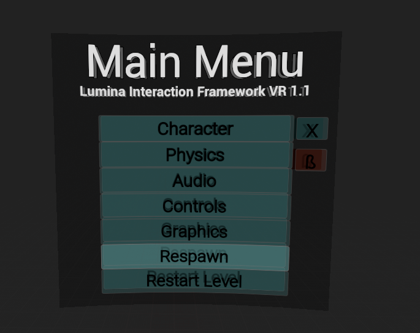

# Lumina Interaction Framework VR (LIFVR) Documentation

---

### _Table of Contents_
---
>:running: [Main Menu](#Menu)

>:gear: [Settings](#Settings)

>:gloves: [Lumina Game Mode](#Lumina-Game-Mode)

---

## 11. Game Framework Classes

### Menu
----

The main menu is intended to be an example of how to setup an in game menu to access variables and change them in runtime. The base for the main menu is the `BP_Menu` actor (child of `Menu` C++). This actor is spawned by the ControllerCharacter class if the Menu enhanced input action is triggered. In there you can adjust the relative location and rotation of the menu to the character. The `BP_Menu` actor contains two widgets, the main widget `BPW_MainMenu` and a second background widget `BPW_MainMenuBackground` (C++ base class: `MainMenu`), which is used to create the 3D effect.

The main menu has a **developer page** with settings, which are useful for development. It can be accessed by clicking the red ß button on the main pa n ge.

### Settings Object
----

### Lumina Game Mode
----